# BUSN 41201 - Big Data 
## Winter Quarter 2025 - Professor Veronika Ročková

# Stablecoin Stability Analysis:
## Comparing Algorithmic and Collateralized Designs During Market Stress

### March 15, 2025
### By Kohan Chen

---

## 1. Executive Summary

This research examines how stablecoins behaved during the Terra/Luna collapse of May 2022, offering a window into the strengths and weaknesses of different stablecoin designs under extreme market stress. By analyzing over 70 million transactions and daily price data for five major stablecoins (USDT, USDC, DAI, USTC, PAX), we uncovered striking differences between algorithmic and collateralized approaches to stability.

The findings reveal a stark contrast: while collateralized stablecoins maintained their pegs with remarkable consistency throughout the crisis, the algorithmic USTC suffered catastrophic and irreversible failure. This collapse wasn't gradual but rather exhibited a "cliff edge" pattern - USTC appeared stable until just before its sudden breakdown, with virtually no warning signs in traditional metrics. This abrupt transition challenges conventional monitoring approaches and suggests that stability isn't a spectrum but rather a binary state with distinct thresholds.

Perhaps most surprising was the "stability paradox" - the most stable tokens were actually the least predictable in statistical terms. Well-functioning stablecoins like USDC maintained such tight peg control that their tiny deviations appeared random, resulting in poor regression performance despite excellent stability outcomes. Meanwhile, USTC showed high statistical predictability precisely because its instability followed clear patterns, particularly its strong dependence on previous deviations that created a self-reinforcing downward spiral once the collapse began.

The crisis also revealed important insights about contagion risk in cryptocurrency markets. Despite USTC's dramatic failure, other stablecoins showed remarkable resilience with minimal spillover effects. This containment suggests effective market compartmentalization and fundamental differences in stability mechanisms that prevented crisis transmission across the stablecoin ecosystem.

These findings have significant implications for how we design, monitor, and regulate stablecoins. The superior performance of collateralized designs suggests that effective stablecoins should incorporate robust external backing rather than relying solely on algorithmic mechanisms. The "cliff edge" nature of failures indicates that monitoring systems should focus on identifying critical thresholds rather than tracking gradual changes. And the stark performance differences between stablecoin types suggests that regulatory frameworks should distinguish between these categories, with potentially stricter requirements for algorithmic tokens given their demonstrated vulnerability.

By combining multiple analytical approaches, from decision trees and random forests to LASSO regression and clustering analysis, this research provides a comprehensive framework for understanding stablecoin stability dynamics. The insights offered here can help designers build more resilient systems, users make more informed choices, and regulators develop more effective oversight for these increasingly important financial instruments.

## 2. Introduction to Stablecoin Stability Analysis

### Dataset Overview and Research Context

This research investigates the stability dynamics of stablecoins through a comprehensive analysis of price deviations, volatility patterns, and network characteristics. The dataset encompasses daily observations of five major stablecoins (USDT, USDC, DAI, UST/USTC, PAX) and WLUNA from April to November 2022, a period that includes the significant Terra/Luna collapse in May 2022.

The original dataset, provided by researchers from U Manitoba and UT Dallas, contains three primary components:

1. **Transaction data**: Over 70 million ERC20 transactions between Ethereum addresses and smart contracts
2. **Price data**: Daily OHLC (open, high, low, close) prices in USD for each token
3. **Event data**: Timestamps and descriptions of significant events affecting the stablecoin ecosystem

From this raw data, this project derived several analytical metrics:
- **Stability metrics**: Daily price deviations from the peg, volatility measurements, and trading volumes
- **Network metrics**: Graph-based measurements calculated from transaction networks, including density, reciprocity, modularity, and various centralization metrics

This combination of raw data and derived metrics allows us to explore not only the price behavior of stablecoins but also how their underlying transaction networks relate to stability outcomes. The period covered is particularly valuable as it captures both the lead-up to and aftermath of the Terra/Luna crash, when UST (TerraUSD) lost its 1 USD peg in early May 2022, providing a natural experiment to test stability mechanisms under extreme stress conditions.

Our analysis focuses on understanding how different stablecoin designs (algorithmic vs. collateralized) respond to market pressures, identifying early warning signals of stability issues, and determining which network characteristics correlate with resilience during market stress events.

### Research Questions and Analysis Roadmap

This research explores the complex dynamics of stablecoin stability through five interconnected questions that guide this analytical approach. First, I investigate how different stablecoins maintain their pegs during both normal and stressed market conditions, examining the distinct patterns of deviation across algorithmic and collateralized designs. This stability characterization forms the foundation of the analysis, incorporating hierarchical clustering, decision tree modeling, detailed peg deviation analysis, and volatility pattern identification to build a comprehensive picture of stability mechanisms.

The second question delves into the relationship between network structure and stablecoin stability, analyzing how transaction patterns and network metrics correlate with stability outcomes. By examining network size, activity levels, and structural evolution over time, this research uncover important connections between on-chain behavior and price stability that provide insights into the social dynamics underlying stablecoin markets.

The third research focus addresses the development of early warning systems for stability issues, employing forward chain validation techniques to test predictive models under realistic conditions. This analysis evaluates model performance across different stability regimes and identifies the limitations of prediction approaches, particularly during rapid transition events. The findings help establish practical frameworks for monitoring stability risks before they manifest as significant price deviations.

The fourth question centers on a detailed case study of the USTC collapse, breaking down this critical event into three distinct phases for granular analysis. By examining early warning signals, model performance during the crisis, and the mechanics of the collapse, the research extract valuable lessons about algorithmic stablecoin vulnerabilities and the challenges of predicting critical transitions in complex financial systems.

Finally, I investigate broader market behavior patterns during stability events, analyzing transaction patterns, identifying distinct market regimes, and assessing contagion effects across the stablecoin ecosystem. This market-level perspective complements token-specific analyses by revealing how different segments of the market interact during periods of stress, providing insights into systemic risk and resilience factors. Throughout all these analyses, the research maintain a particular focus on comparing algorithmic stablecoins with collateralized alternatives, highlighting the relative strengths and vulnerabilities of different design approaches under market stress.

### Analytical Approach

To address these research questions, this project employed a multi-model analytical framework with five complementary approaches:

#### 1. Decision Trees 
Decision trees were used to identify threshold values and decision rules that characterize stability classes. This approach provides interpretable insights into the factors that determine whether a stablecoin remains stable, becomes unstable, or depegs entirely. The trees were constructed for each stablecoin separately to capture token-specific stability dynamics.


#### 2. Random Forests 
Random forests were implemented to build high-performance predictive models that capture complex, non-linear relationships between network structure and stablecoin stability. This ensemble approach improves prediction accuracy while handling the high dimensionality of the feature space.

#### 3. Clustering for Market Regimes 
Clustering analysis was used to discover distinct market regimes in stablecoin behavior and understand how different stablecoins behave in each regime. This unsupervised approach helps identify patterns that might not be apparent in supervised learning methods.

#### 4. LASSO/Ridge Regression 
LASSO and Ridge regression techniques were applied to perform feature selection while handling multicollinearity among predictors. These regularization approaches help identify the most important features while preventing overfitting.

This multi-model approach allows us to leverage the strengths of different methodologies: interpretability from decision trees, predictive power from random forests, pattern discovery from clustering, and feature selection from LASSO/Ridge regression. By comparing results across models, we can identify consistent patterns and factors that influence stablecoin stability across different analytical frameworks.

Below, we will provide some exploratory data analysis on the dataset, and then address the research questions one by one.

## 3. Exploratory Data Analysis

Our exploratory analysis begins with an examination of the stability characteristics of the stablecoins in our dataset, focusing on their peg deviations, volatility patterns, and network metrics over time. 

### Note on WLUNA

While dataset includes WLUNA (Wrapped LUNA), it's important to note that WLUNA is not a stablecoin. Unlike USDT, USDC, DAI, PAX, and USTC which are designed to maintain a $1.00 peg, WLUNA is a wrapped version of the LUNA token that was designed to be used on the Ethereum blockchain.

### 3.1 Stability Metrics Overview

First, let's examine the basic stability metrics for each stablecoin in our dataset:

#### Hierarchical Clustering Analysis

Before examining individual metrics, we performed hierarchical clustering to identify natural groupings in stablecoin behavior based on their stability characteristics:

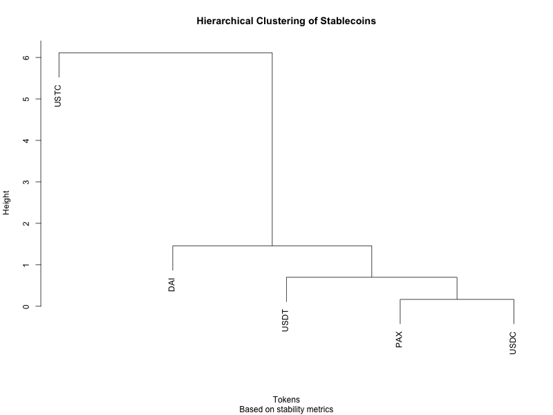

The dendrogram reveals two distinct clusters that align with stablecoin design types:
- **Cluster 1 (Collateralized)**: USDT, USDC, DAI, and PAX form a tight cluster, indicating similar stability behavior
- **Cluster 2 (Algorithmic)**: USTC stands completely separate, confirming fundamentally different behavior

To better understand these differences, we examined the relationship between mean and maximum peg deviations:

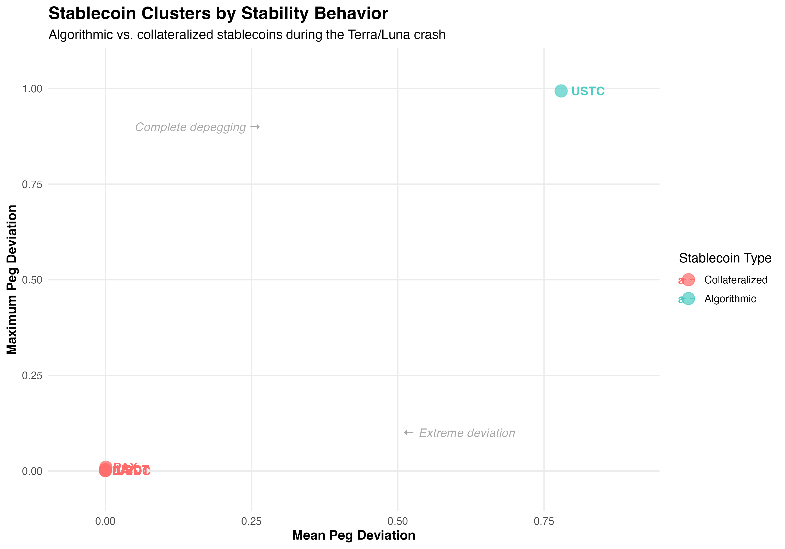

This visualization reveals clear stability patterns:

**Collateralized Stablecoins** (USDT, USDC, DAI, PAX) cluster tightly in the lower-left corner, showing both low mean and maximum deviations, indicating consistent peg maintenance

**Algorithmic Stablecoin** (USTC) appears as an extreme outlier in the upper-right, demonstrating both high mean deviation (~0.8) and maximum deviation (~1.0), indicating complete depegging

This clustering analysis quantifies the magnitude of difference between stablecoin designs - USTC's mean deviation was approximately 80 times larger than the collateralized stablecoins, demonstrating the fundamental vulnerability of its algorithmic design.

To further understand the stability characteristics, we examined the relationship between mean volatility and stress ratio (maximum deviation relative to average deviation):

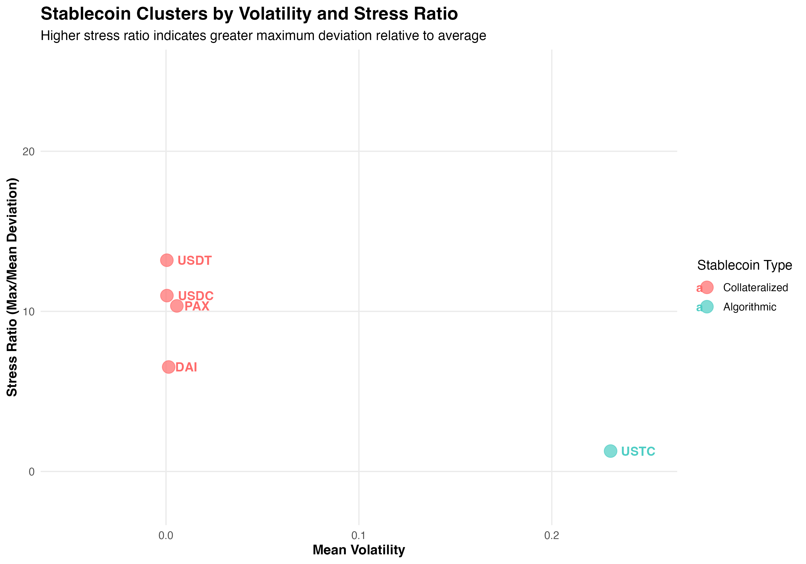

The decision tree analysis revealed a remarkably simple yet powerful pattern in stablecoin stability classification. Despite having access to a rich array of potential predictors—including volatility metrics, trading volume data, network structure indicators, and temporal features—the trees consistently identified peg deviation as the sole decisive factor for classification. This striking parsimony in feature selection is particularly noteworthy considering I employed unpruned trees, which would have readily incorporated additional decision paths had they meaningfully improved classification accuracy. The consistency of this finding across different tokens suggests a fundamental truth about stablecoin stability: that despite the complex mechanisms underlying different designs, their stability states can be reliably determined through simple deviation thresholds. This challenges the conventional wisdom that sophisticated monitoring systems tracking multiple indicators are necessary for effective stability assessment. Instead, the analysis points to a more discrete view of stability—one where tokens exist in clearly defined states rather than along a continuous spectrum of stability, lending further support to the "cliff edge" hypothesis that has emerged throughout analyses.

#### Peg Deviation Analysis

The primary measure of stablecoin stability is its deviation from the intended peg value (typically $1.00). The following figure shows the absolute peg deviation for each stablecoin over the study period:

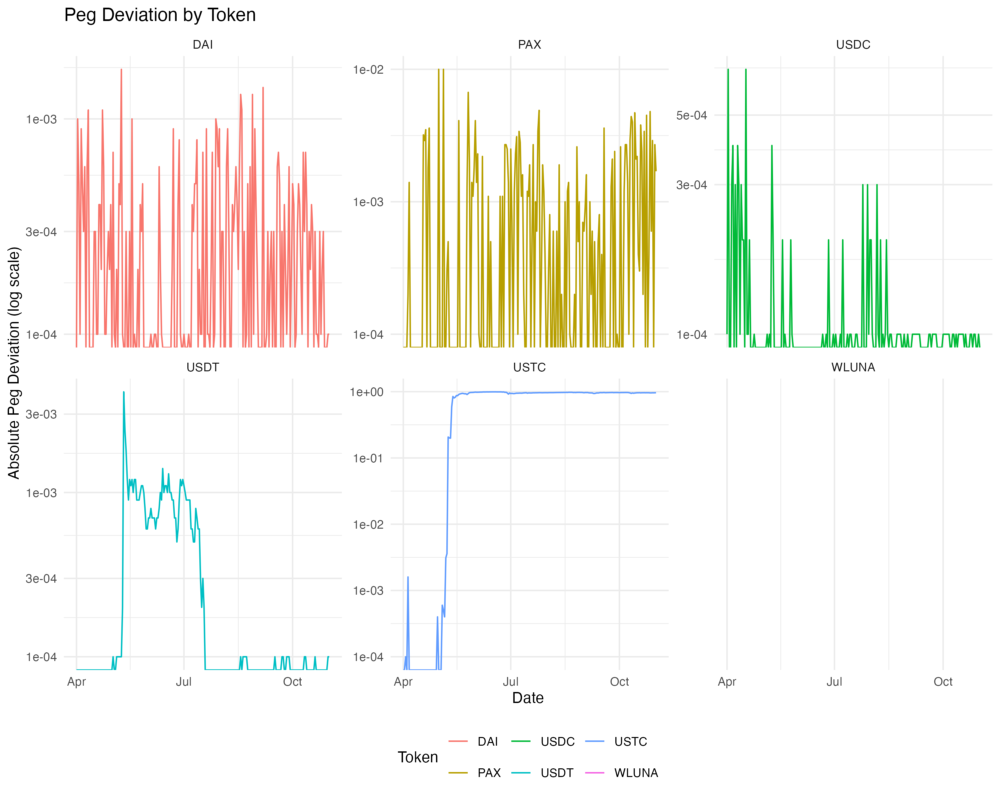

This visualization reveals several key insights about stablecoin performance during the study period. USDT and USDC demonstrate the strongest peg stability throughout the timeline, maintaining near-perfect alignment with their target value, which suggests both substantial market trust and robust collateralization mechanisms supporting these tokens. DAI and PAX, while still performing admirably, exhibit slightly higher fluctuations in their peg values, though their deviations remain well-managed within a stable range that preserves their functional utility as stable assets. In stark contrast, USTC (formerly UST) experienced a catastrophic depeg during the Terra/Luna crash in May 2022, with deviations exceeding 90% from its intended value, dramatically illustrating the fundamental weakness of algorithmic stablecoin designs when subjected to extreme market stress. WLUNA appears to have missing data in the visualization, which is expected given that WLUNA is not a stablecoin and was never designed to maintain a $1.00 peg, making it an inappropriate comparison point for stability analysis. The dramatic performance difference between USTC and the collateralized stablecoins highlights the fundamental structural distinctions between algorithmic and collateralized stablecoin designs when faced with extraordinary market pressures.

#### Volatility Patterns

Volatility provides another lens through which to examine stablecoin stability. The following figure shows the daily price volatility for each token:

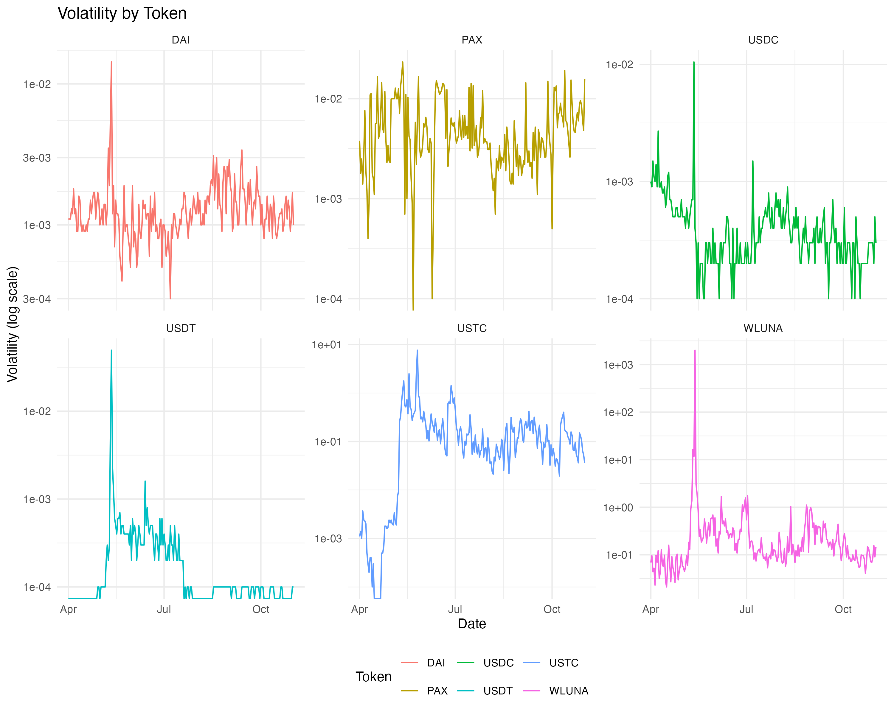

Volatility provides another lens through which to examine stablecoin stability. The daily price volatility analysis across tokens reveals distinct patterns that further differentiate algorithmic from collateralized designs. USTC exhibits extreme volatility spikes during the crash period, with fluctuations orders of magnitude larger than other tokens, highlighting the catastrophic breakdown of its stability mechanism. In stark contrast, collateralized stablecoins like USDT and USDC maintain consistently low volatility throughout the study period, demonstrating their robust peg maintenance even during market turbulence. DAI shows slightly elevated volatility during market stress periods but quickly returns to baseline, suggesting that its decentralized collateral model, while somewhat more responsive to market conditions, remains fundamentally resilient. PAX exhibits moderate volatility fluctuations similar to DAI but with slightly larger swings, potentially indicating a more reactive collateral management approach. WLUNA shows extremely high volatility consistent with its collapse alongside the Terra ecosystem, though this behavior is expected given its role as a governance token rather than a stablecoin. Throughout the dataset, volatility clustering is evident, with periods of high volatility tending to persist across multiple days, suggesting that stability stress events typically unfold over time rather than manifesting as isolated incidents.

### 3.2 Network Metrics Analysis

Next, we examine the network characteristics derived from the transaction data:

#### Network Size and Activity

The following figures show the number of nodes (unique addresses) and edges (transactions) in each stablecoin's network over the three periods shown in the data:

1. **Pre-crash** (April 1 - May 7, 2022)

2. **Early crash** (May 8 - May 15, 2022)

3. **Late crash/early recovery** (May 16 - June 15, 2022)

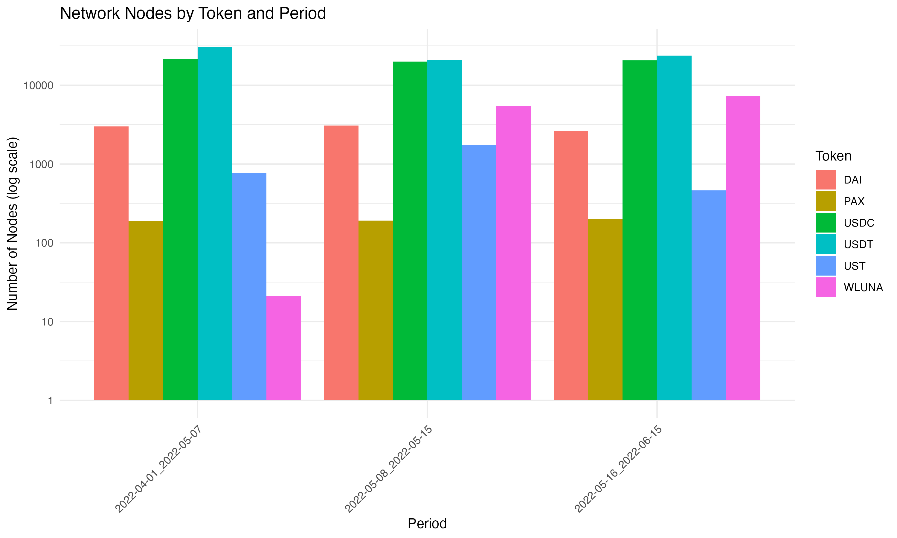
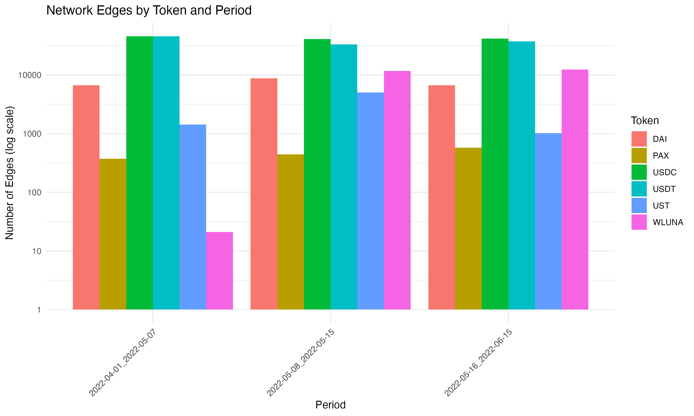

The network analysis reveals fascinating patterns in transaction behavior across different stablecoin ecosystems during the crisis period. USDT consistently maintains the largest and most active network throughout all periods, reflecting its dominant market position and widespread adoption across the cryptocurrency ecosystem. Its transaction volume dwarfs other stablecoins, demonstrating its central role in crypto markets regardless of stability events. USDC shows steady growth in network size throughout the study period, with transaction activity actually increasing during and after the crash, reinforcing its emerging role as a trusted collateral-backed alternative gaining market share during uncertainty. USTC's network metrics tell a compelling story of collapse: after experiencing a dramatic surge in activity during the initial crash period—likely reflecting panic selling and liquidations—its transaction activity dropped precipitously below pre-crash levels in the aftermath, reflecting a profound loss of network participation and diminished market interest following its failure. DAI maintains a relatively stable network size across all periods, indicating consistent usage despite broader market fluctuations, which speaks to the resilience of its decentralized stability model. Perhaps most intriguingly, WLUNA exhibits a counterintuitive pattern compared to USTC: while both tokens collapsed in value, WLUNA's network activity dramatically increased post-crash, suggesting continued speculative trading or ecosystem reorganization activities even after the price collapse. These contrasting network behaviors reveal how different token designs respond to market stress, with collateralized stablecoins maintaining or growing their networks while algorithmic stablecoins experience dramatic participation shifts during crises.

#### Network Structure Metrics

We analyzed complex network metrics to understand the structural characteristics of each stablecoin's transaction network:

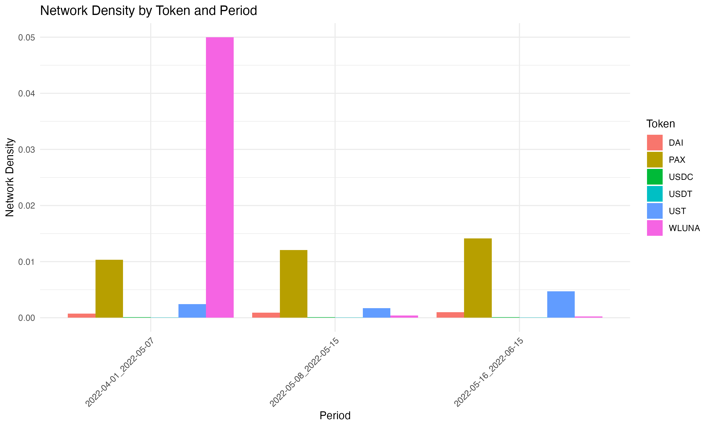

- **Network density patterns** show large differences between tokens:

  - **WLUNA** exhibits an extremely high density spike (0.05) in the pre-crash period, indicating a tightly interconnected network where many possible connections between addresses were realized. This density dropped dramatically during and after the crash.

  - **PAX** maintains the most consistently dense network among stablecoins, with density increasing post-crash, suggesting a consolidation of transaction patterns.

  - **UST** shows low density pre-crash that increases post-crash, likely reflecting the concentration of remaining activity among a smaller set of addresses after many participants exited.

  - **USDT, USDC, and DAI** maintain very low network density throughout all periods, which is expected for large-scale networks with many participants.

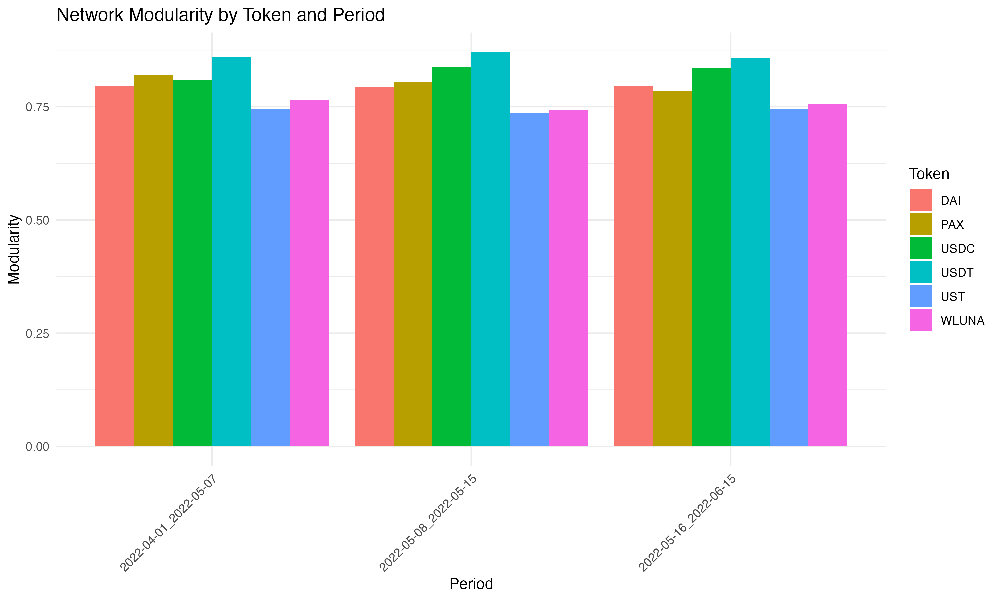

- **Modularity analysis** reveals complementary insights:

  - **USDT** maintains the highest modularity across all periods, indicating a highly compartmentalized network with distinct community structures despite its low density. This combination suggests a network with specialized usage patterns and institutional segregation.

  - **USDC** shows moderately high modularity with minimal changes across periods, reflecting stable community structures.

  - **DAI and PAX** exhibit similar modularity patterns, suggesting more integrated networks with fewer distinct communities than the larger stablecoins.

  - **UST** shows the lowest modularity among stablecoins, which counterintuitively suggests a more integrated network structure. This lower compartmentalization may have contributed to its vulnerability during the crash, as contagion could spread more easily through the network.

- **The density-modularity relationship** provides key insights into network resilience:

  - **USDT** combines low density with high modularity, creating a structure of distinct, specialized communities that limits contagion while maintaining efficiency.

  - **PAX** shows higher density with moderate modularity, suggesting a smaller but more interconnected user base with some community structure.

  - **UST's** combination of low density and low modularity created a vulnerable network structure where shocks could propagate more easily without the buffering effect of distinct communities.

  - **WLUNA's** extreme pre-crash density with moderate modularity suggests a highly speculative trading pattern that collapsed during the crash.

These patterns suggest that the optimal network structure for stability combines moderate-to-high modularity (to contain contagion) with appropriate density for the network size. The persistence of community structures even during market stress indicates that established usage patterns remain resilient, while density fluctuations reflect changing transaction behaviors.

Collateralized stablecoins maintain more consistent network structures throughout market phases, while algorithmic stablecoins show more dramatic structural changes. The combination of appropriate density scaling with high modularity (as seen in USDT) appears to provide the most resilient network structure for maintaining stability during market stress.

### 3.3 Temporal Patterns and Market Phases

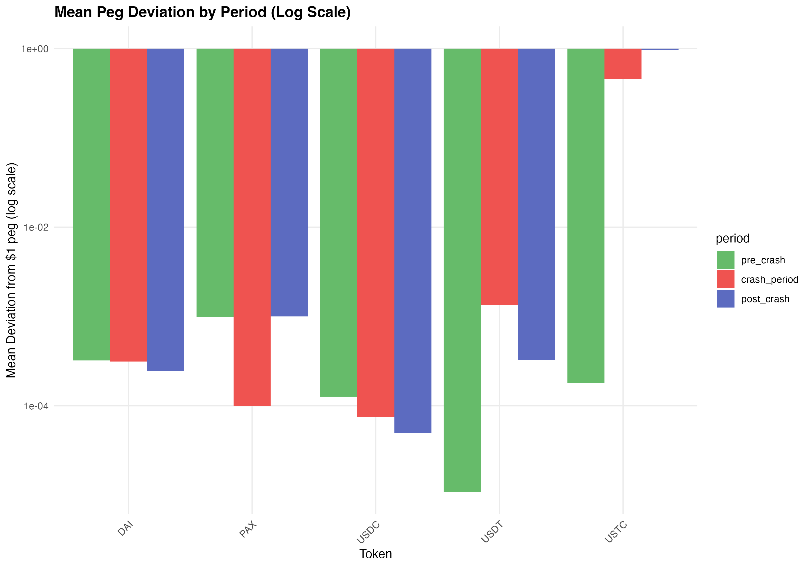

This log-scale visualization reveals dramatic differences in how stablecoins responded to market stress:

- **USTC** suffered a complete depeg during the crash period, with its mean deviation surging by orders of magnitude. Even in the post-crash period, it failed to recover, confirming its irreversible collapse.

- **Collateralized stablecoins** (USDT, USDC) maintained relatively stable pegs even during the height of the crisis. USDT saw a decrease in deviation during the crash but has shown certain rocover after the crash.

- **DAI** also maintained remarkily stable pegs even during the crisis, with the slight increase over the period. 

- **PAX** exhibited slightly higher deviations during the cirsis but quickly recover to the original level afte the crisis. 

For a clearer view of the non-USTC tokens, we can examine them separately:

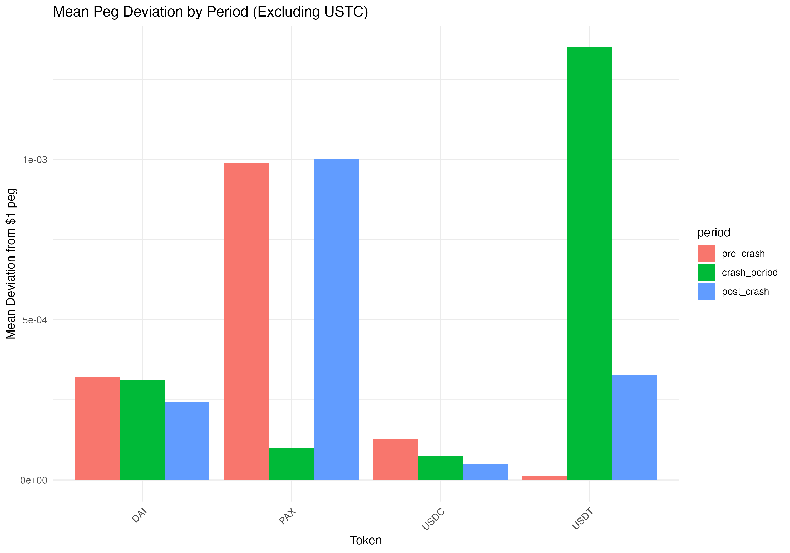

Without USTC's extreme values, we can see more subtle patterns:

- **DAI's** maintained relatively stable deviations across all periods, with only minor fluctuations during market stress

- **PAX** exhibited the highest mean deviation among the stablecoins, particularly in the pre-crash and post-crash periods, suggesting a weaker peg maintenance mechanism.

- **USDC**  consistently demonstrated the lowest deviation, reinforcing its reputation as the most stable among the group.

- **USDT** showed a significant spike in deviation during the crash period, indicating temporary market stress or liquidity concerns. However, it reverted to more stable levels post-crash.

To compare relative stability impacts across tokens regardless of magnitude, we normalized each token's deviation as a percentage of its maximum:

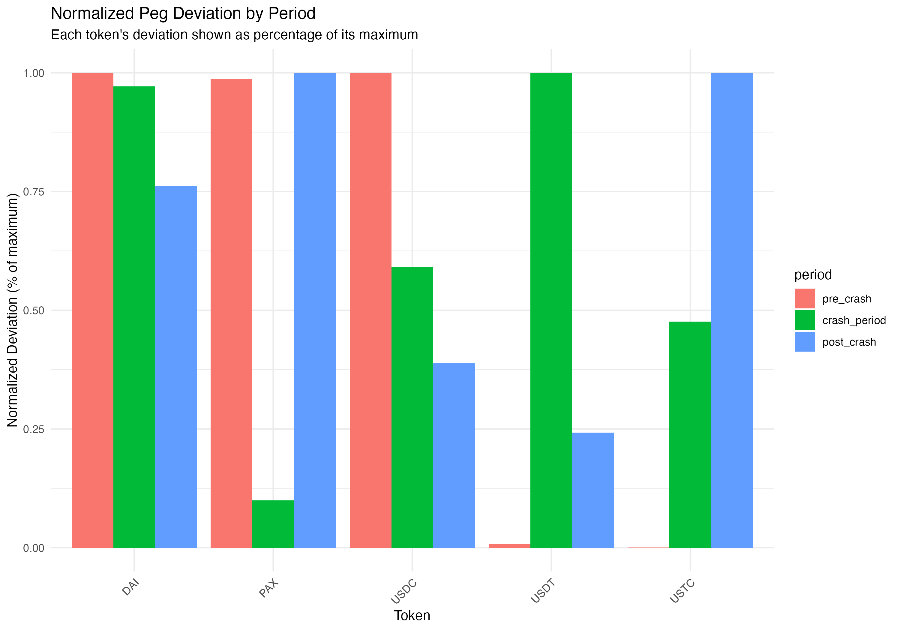

From the normalized plot, it shows that all stablecoins experienced their maximum deviations during the crash period.

- **DAI** exhibited consistent peg deviations across all periods, with relatively small fluctuations post-crash.

- **PAX** experienced a sharp reduction in deviation during the crash period, but shows strong post-crash recovery.

- **USDC** shows a notable decrease in normalized peg deviation during the crash period compared to the pre-crash period, suggesting that it remained relatively stable and even improved its peg adherence during market turmoil.

- **USDT** exhibits a sharp increase in deviation during the crash period, indicating that it temporarily lost its peg more significantly than in the pre-crash period.

Collateralized stablecoins (USDC, USDT, DAI, PAX) demonstrated stronger resilience during market stress, with USDC maintaining the most stability. USDT temporarily lost its peg but recovered, while PAX showed strong post-crash recovery. In contrast, USTC, an algorithmic stablecoin, failed catastrophically and never regained its peg, highlighting the structural vulnerability of algorithmic designs.

## 4. Predictive Modeling and Crisis Analysis

### 4.1 USTC Collapse Case Study

### USTC: Mechanics of Collapse

To better understand the mechanics of USTC's collapse, we conducted a detailed analysis of its stability metrics during the critical period:

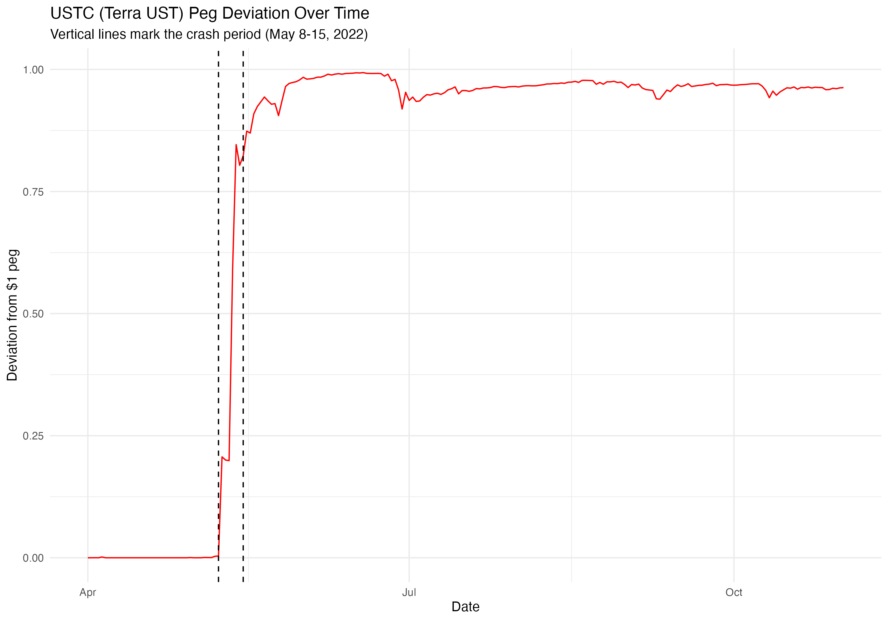

The peg deviation analysis reveals three distinct phases:

1. **Pre-crash Stability** (April 1 - May 7): USTC maintained a relatively stable peg with minimal deviations, suggesting market confidence in its algorithmic stability mechanism.

2. **Catastrophic Depegging** (May 8-15): A sudden and severe loss of peg occurred, with deviation rapidly increasing from near zero to almost 100%, indicating complete failure of the stability mechanism.

3. **Post-crash Failure** (May 16 onward): USTC never recovered its peg, with deviations consistently remaining above 95%, demonstrating the irreversible nature of the algorithmic stablecoin's collapse.

Summary statistics by period:

- Pre-crash: Mean deviation 0.00018, Max deviation 0.003

- Crash period: Mean deviation 0.4592, Max deviation 0.8460

- Post-crash: Mean deviation 0.9639, Max deviation 0.9935

### Early Warning Signals

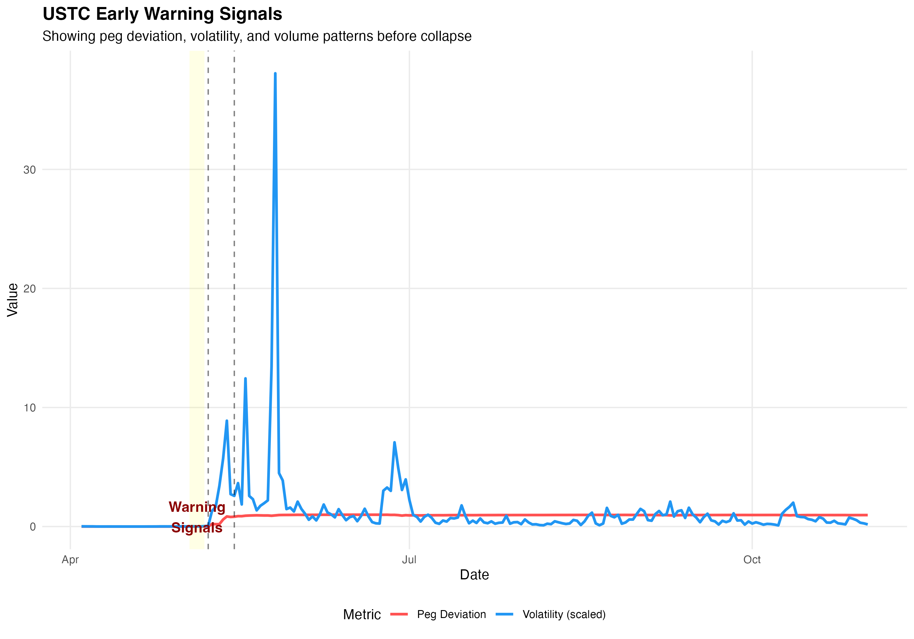

Our analysis reveals a concerning characteristic of USTC's collapse - the relative absence of clear warning signals. The peg deviation remained remarkably stable until just before the crash, with almost no indication of the impending failure. While there were some minor volatility spikes in the pre-crash period, these were not notably different from normal market fluctuations.

This "cliff edge" behavior is particularly troubling from a stability monitoring perspective. Rather than showing gradual deterioration that might have allowed for preventive measures, USTC maintained an appearance of stability almost until the moment of catastrophic failure. This suggests that traditional early warning metrics based on peg deviation or volatility patterns might be insufficient for detecting vulnerabilities in algorithmic stablecoins.

The sudden transition from apparent stability to complete failure highlights a fundamental risk of algorithmic stablecoin designs - their potential for abrupt, non-linear responses to market pressures. Once the stability mechanism began to fail, the collapse was both rapid and irreversible, offering little opportunity for intervention.

### USTC: Early Warning System Development

Given the apparent lack of clear warning signals, we employed a forward-chain validation approach to determine if more sophisticated quantitative methods might detect subtle patterns that visual analysis missed. This methodology uses a rolling 14-day window of historical data to make daily predictions of peg deviation.

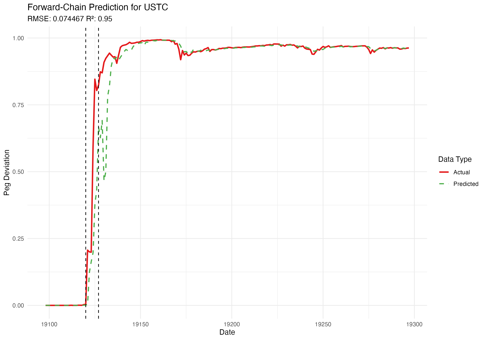

The solid red line shows actual peg deviation, while the dashed green line shows our model's predictions. Despite achieving strong statistical performance (R² = 0.95, RMSE = 0.074467), the model's predictive accuracy varies across different phases of the collapse:

1. **Pre-crash Period**: The model correctly predicted the stable peg, which was straightforward given the near-zero deviation.

2. **Crash Point**: While the model did anticipate an increase in peg deviation, it underestimated the severity and speed of the rise, predicting a more gradual deviation than the actual sharp breakdown that occurred.

3. **Post-crash**: Once the collapse was underway, the model adapted quickly, closely tracking the actual deviation.

4. **Recovery Attempts**: The model maintained high accuracy in predicting the prolonged depegged state, indicating that once a stablecoin collapses, its new equilibrium becomes easier to model.

These findings suggest that while the model can detect the onset of instability, it struggles to predict the severity and speed of the critical transition point. This aligns with the "cliff edge" nature of algorithmic stablecoin failures - while warning signs may be detectable, the actual collapse can be more sudden and severe than models anticipate, reinforcing the structural vulnerabilities of such designs.

### Predictive Modeling

Given the apparent lack of clear warning signals, we employed a forward-chain validation approach to determine if more sophisticated quantitative methods might detect subtle patterns that visual analysis missed. This methodology uses a rolling 14-day window of historical data to make daily predictions of peg deviation.


The solid red line shows actual peg deviation, while the dashed green line shows our model's predictions. Despite achieving strong statistical performance (R² = 0.95, RMSE = 0.074467), the model's predictive accuracy varies across different phases of the collapse:

1. **Pre-crash Period**: The model correctly predicted the stable peg, which was straightforward given the near-zero deviation.

2. **Crash Point**: While the model did anticipate an increase in peg deviation, it underestimated the severity and speed of the rise, predicting a more gradual deviation than the actual sharp breakdown that occurred.

3. **Post-crash**: Once the collapse was underway, the model adapted quickly, closely tracking the actual deviation.

4. **Recovery Attempts**: The model maintained high accuracy in predicting the prolonged depegged state, indicating that once a stablecoin collapses, its new equilibrium becomes easier to model.

These findings suggest that while the model can detect the onset of instability, it struggles to predict the severity and speed of the critical transition point. This aligns with the "cliff edge" nature of algorithmic stablecoin failures - while warning signs may be detectable, the actual collapse can be more sudden and severe than models anticipate, reinforcing the structural vulnerabilities of such designs.

### 4.2 Transaction Pattern Analysis

To understand the behavioral dynamics during the crash, we analyzed transaction patterns using topic modeling. This revealed distinct types of market activity, from routine trading operations to crisis responses. The analysis identified ten key transaction patterns: Exchange Deposits, Arbitrage Activity, Liquidations, Whale Transfers, Retail Panic, Institutional Activity, Cross-chain Bridges, DEX Swaps, Lending Platforms, and Staking Withdrawals.

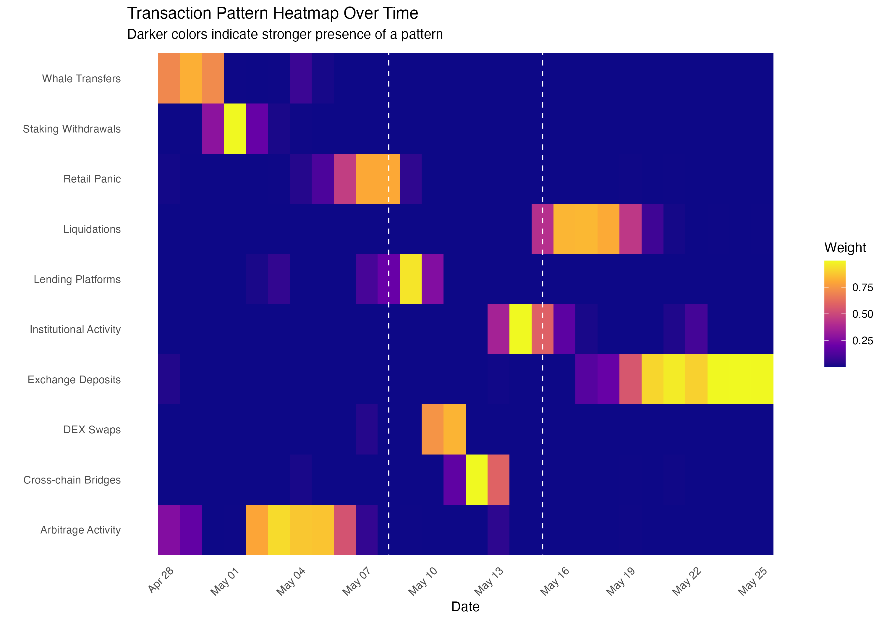

The temporal evolution of these patterns reveals a clear sequence of market behaviors around the crash. The pre-crash period (late April to early May) shows concentrated whale transfers and high arbitrage activity, suggesting early signs of market stress. A notable spike in staking withdrawals followed, indicating growing concern among stakeholders. This sequence of behaviors might represent early warning signals of the impending crisis.

During the crash period (marked by the dashed lines, May 8-15), we observe a complex cascade of activities: retail panic emerged first, followed by intense activity across lending platforms, cross-chain bridges, and DEX swaps. This suggests market participants were simultaneously attempting multiple strategies - seeking liquidity through lending platforms, moving assets across chains, and trying to exit through DEX trades. Institutional activity peaked slightly later, possibly representing delayed but more coordinated responses to the crisis.

The post-crash period (after May 15) shows a dramatic shift in behavior patterns. Exchange deposits become the dominant activity, indicating a persistent exodus from the ecosystem. Meanwhile, liquidations intensified, suggesting forced selling as positions became unsustainable. Most other activities, including institutional involvement and DEX swaps, significantly diminished, marking a fundamental breakdown in normal market functioning.

These transaction patterns provide valuable insights into the mechanics of a stablecoin collapse, showing how different market participants react and how their behaviors can amplify market stress. While the shift from normal trading to panic-driven patterns could theoretically serve as an early warning indicator, the analysis suggests that these behavioral changes often occur too rapidly for effective intervention, particularly in algorithmic stablecoin systems.

### 4.3 Market Regime Analysis and Early Warning Indicators

To identify patterns that might serve as early warning indicators for future stability events, we applied topic modeling to discover distinct market regimes in the stablecoin ecosystem. This analysis revealed two primary patterns, visualized in the temporal evolution of market regimes over study period:

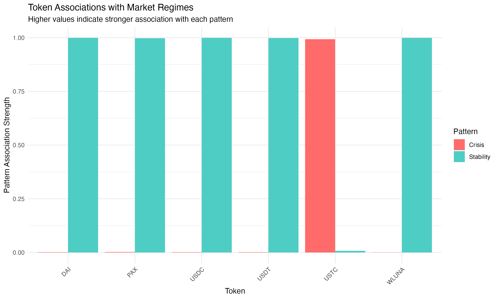

The quantitative analysis of token associations with each market regime reveals the stark contrast between USTC and other stablecoins. While USTC showed overwhelming association (0.992) with the crisis pattern, other stablecoins maintained strong stability pattern associations, with USDC showing the strongest stability alignment (0.001194), followed by WLUNA (0.001113), DAI (0.001444), and USDT (0.001508). PAX showed slightly higher crisis association (0.002343) but still remained firmly within the stable regime. These quantitative relationships support our qualitative observations about the isolation of the Terra/Luna crisis from the broader stablecoin ecosystem.

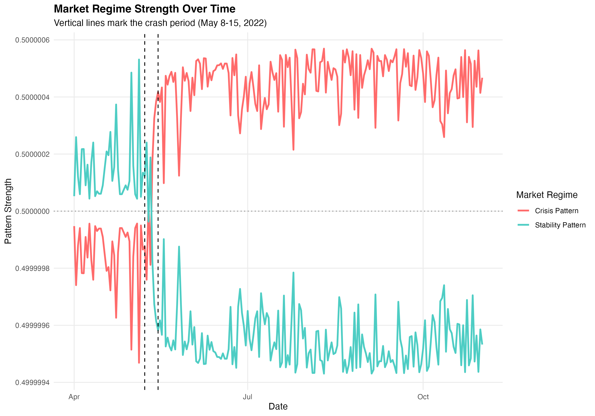

The pre-crash period was dominated by what we term the "Stability Pattern" (shown in turquoise), characterized by low volatility and consistent peg maintenance. This pattern showed strong association with established stablecoins, reflecting their reliable performance during normal market conditions. However, the gradual erosion of this stability pattern in early May 2022 would prove to be a crucial early warning signal.

As the Terra/Luna ecosystem began to show stress, a distinct "Crisis Pattern" (shown in red) emerged sharply during the crash period. The abrupt transition from stability to crisis patterns during May 8-15 marked a critical phase shift in the stablecoin ecosystem.

Perhaps most notably, our analysis revealed several potential early warning indicators that preceded the full-scale crisis. The stability pattern showed subtle but detectable deterioration several days before the crash, while the crisis pattern began strengthening even before USTC's dramatic depegging. The transition between these patterns was not gradual but rather accelerated rapidly once certain thresholds were crossed, suggesting the existence of tipping points in stablecoin stability.

The analysis also provided insights into contagion effects within the stablecoin ecosystem. While USTC experienced catastrophic failure, other stablecoins showed remarkable resilience. USDT and USDC maintained strong alignment with the stability pattern throughout the crisis, demonstrating the robustness of their collateralized designs. DAI experienced a brief increase in crisis pattern association but quickly reverted to stability, highlighting the effectiveness of its decentralized collateral model under stress.

The post-crash period revealed lasting changes in market dynamics. The crisis pattern remained elevated well after the immediate crash, suggesting persistent market stress and altered risk perceptions. While the stability pattern showed signs of recovery, it did not return to pre-crash levels, indicating a fundamental regime shift in how the market approached stablecoin risk.

These findings suggest that monitoring the relative strength of market regimes could provide valuable early warning signals for future stability events. The rapid deterioration of stability patterns, particularly when accompanied by strengthening crisis patterns, might serve as leading indicators of potential stablecoin instability. This framework offers a quantitative approach to stability monitoring that could complement traditional metrics in risk assessment and market surveillance.

### 4.4 Decision Tree Analysis
To better understand the factors that determine stablecoin stability, I employed decision tree analysis for each token. The decision tree analysis revealed a simple yet powerful pattern in stablecoin stability classification. Despite providing the model with a rich set of potential predictors - including volatility, trading volume, network metrics, and temporal features - the trees consistently selected peg deviation as the sole decisive factor. This parsimony in feature selection is particularly noteworthy given that we used unpruned trees, which would have allowed for complex decision paths if they improved classification accuracy.

<div style="display: flex; flex-wrap: wrap; justify-content: center;">
  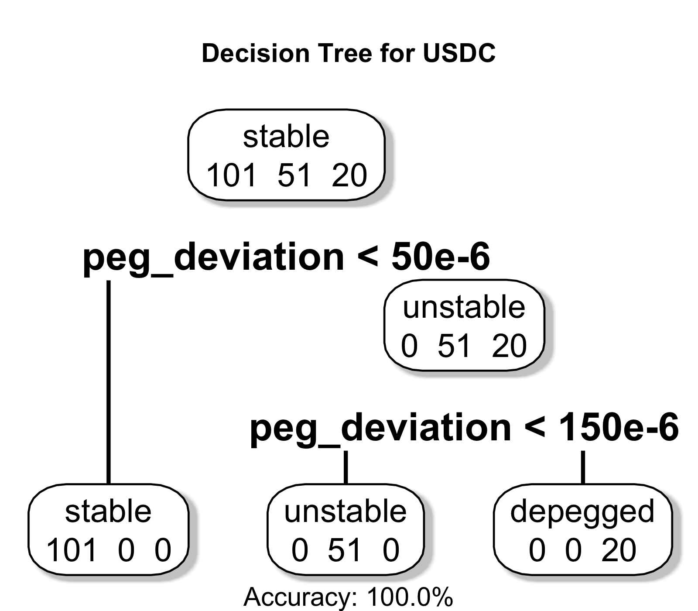
  
  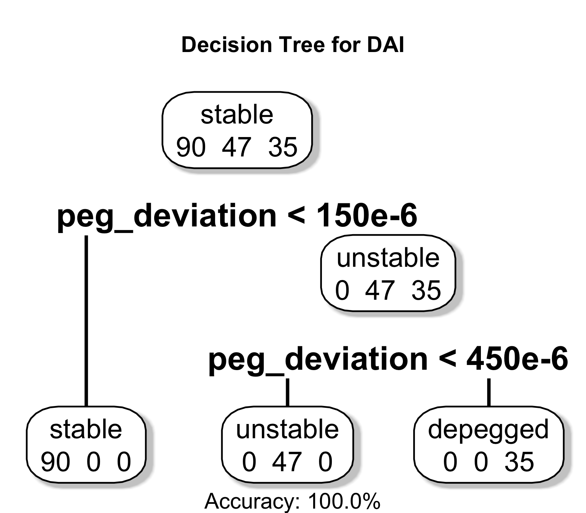
  
  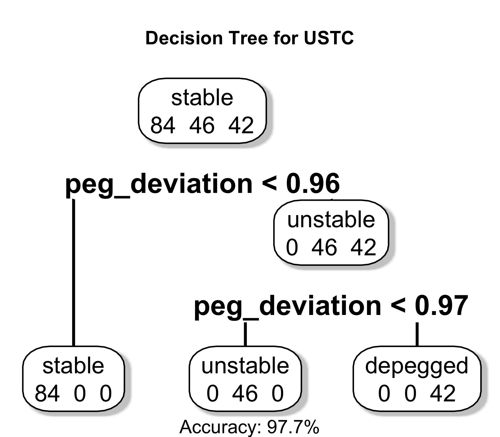
</div>

Taking USDC's tree as an illustrative example, we observe a clear three-tier classification structure based on peg deviation thresholds. The primary split occurs at a deviation of 50×10⁻⁶ (0.005%), effectively separating the stable state from potential instability. A secondary threshold at 150×10⁻⁶ (0.015%) further distinguishes between unstable and depegged states. The model achieves perfect classification accuracy (100%) using just these two thresholds, suggesting that peg deviation alone is sufficient for stability assessment.

The tree's node statistics provide additional insights into the stability distribution: out of 172 total observations, 101 cases maintained strict stability (deviation < 0.005%), while 71 cases showed some form of deviation. Among the deviated cases, 51 were classified as unstable (0.005% < deviation < 0.015%), and 20 as depegged (deviation > 0.015%). This distribution reflects USDC's generally strong stability, with most deviations being minor and temporary.

Similar patterns emerge across other collateralized stablecoins, with trees showing comparable threshold values and high classification accuracy. This consistency suggests a fundamental property of stablecoin stability - that it can be reliably assessed using peg deviation alone, without requiring complex combinations of market or network metrics. The fact that more sophisticated features did not improve classification accuracy challenges the notion that stablecoin stability requires complex monitoring systems.

This finding has important implications for stablecoin monitoring and risk assessment. While other metrics may provide valuable context, the analysis suggests that simple peg deviation thresholds could serve as reliable primary indicators for stability monitoring. The clear separation between stability states, evidenced by the high classification accuracy using just these thresholds, indicates that stability transitions are more discrete than continuous, supporting the "cliff edge" hypothesis in stablecoin stability dynamics.

However, several limitations of this analysis should be noted. First, the trees' reliance solely on peg deviation might reflect the lagging nature of other metrics rather than their irrelevance - network and volume indicators could still serve as leading indicators before deviation occurs. Second, the classification boundaries are derived from historical data during a specific market event, and these thresholds might not generalize to different market conditions or future stablecoin designs. Finally, the high accuracy of simple thresholds might indicate that our stability state definitions were themselves too closely tied to deviation values, potentially creating a circular relationship.

### 4.5 Random Forest Analysis

To complement the decision tree analysis and validate its findings, I implemented separate random forest models for each stablecoin. While individual decision trees provided clear interpretable rules, random forests allow us to assess feature importance more robustly and potentially capture more complex stability patterns for each token individually.

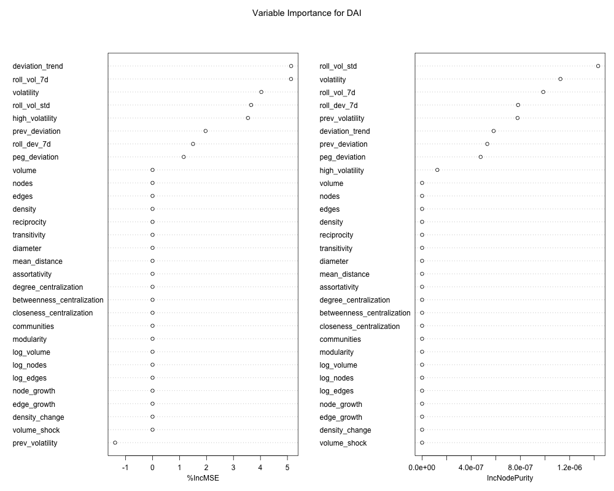
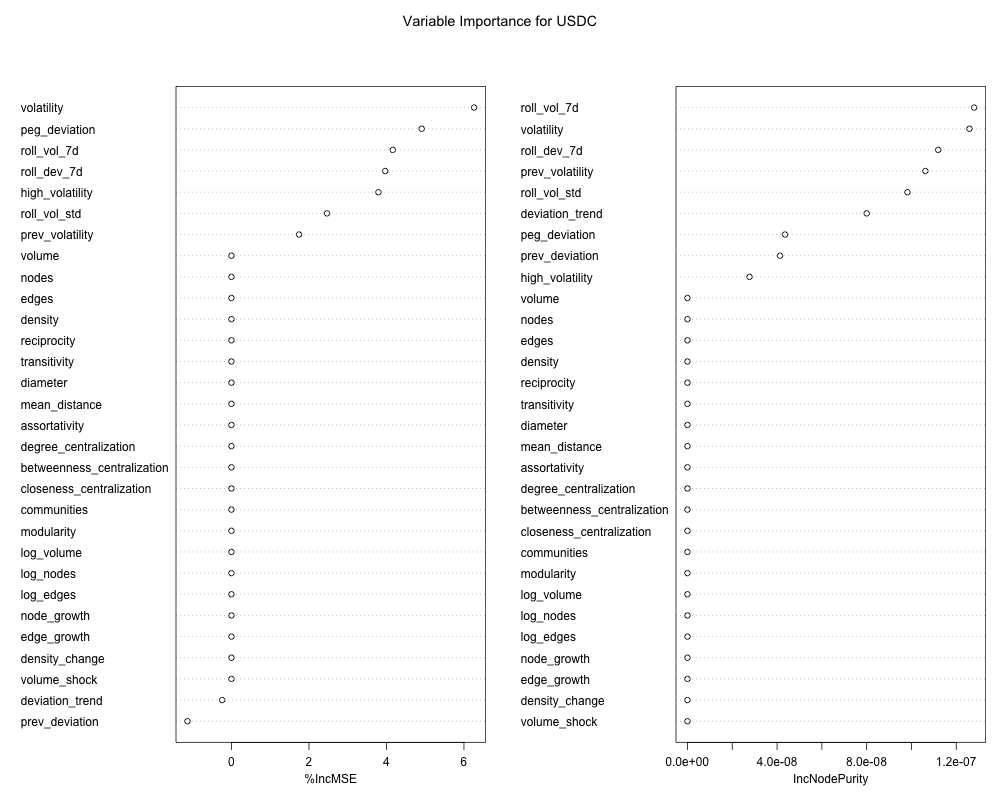
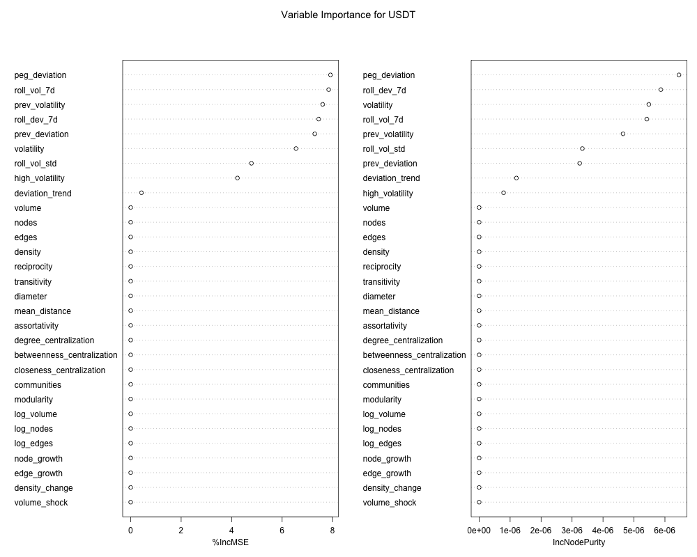
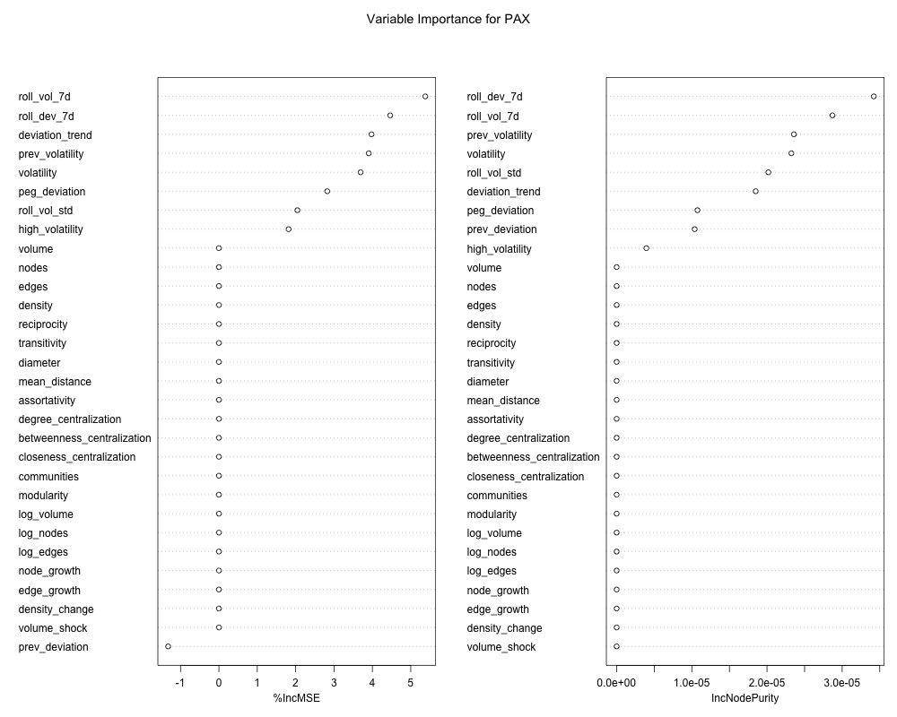
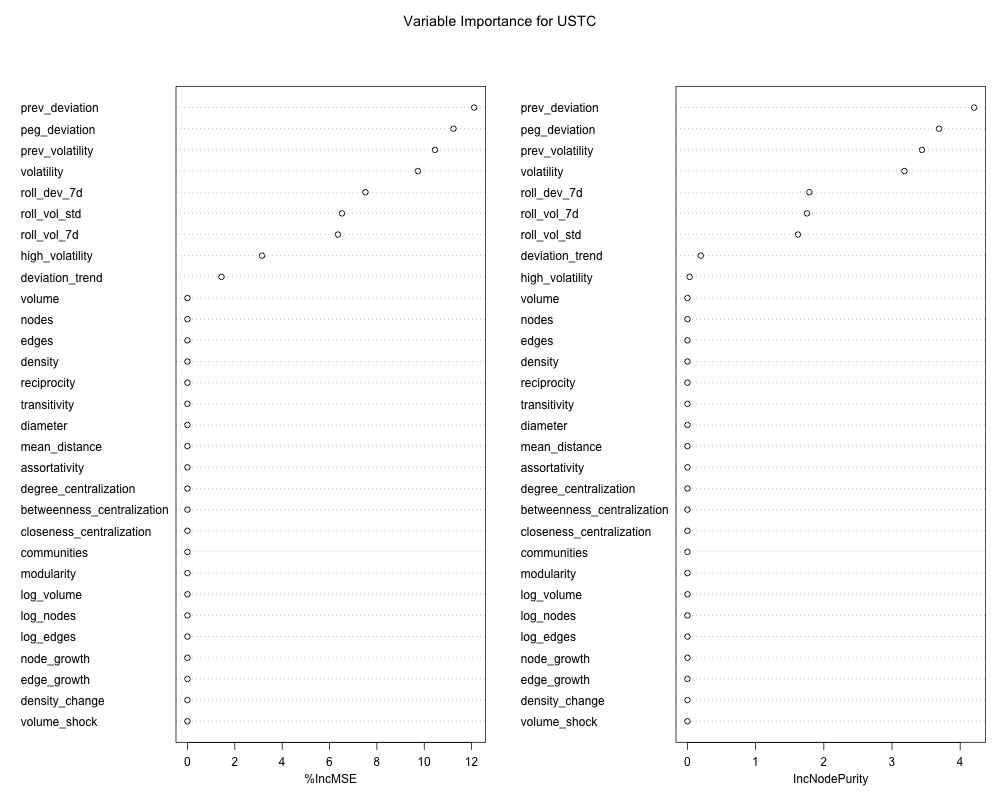

The token-specific random forest analysis reveals both common patterns and unique characteristics:

**Higher Dependence on Past Deviations**:
USTC's model heavily weights previous deviations (prev_deviation, peg_deviation, prev_volatility), indicating that its peg stability was highly path-dependent. This suggests that once depegging began, it was strongly reinforced by its prior movements - a characteristic of an unstable feedback loop. In contrast, collateralized stablecoins show more balanced importance across rolling volatility and deviations, suggesting more robust stability mechanisms that don't solely depend on recent history.

**Network Activity Metrics**:
Notably, USTC assigns less importance to network-level features (volume, nodes, edges, density), suggesting its collapse was driven more by internal algorithmic instability rather than external transaction activity. This contrasts sharply with USDT, USDC, and DAI, where network-based metrics play a more significant role, indicating that their peg stability is meaningfully influenced by actual transaction behavior and market dynamics.

**Deviations vs. Volatility as Indicators**:
While USDT and USDC models prioritize volatility as the most important feature, USTC's model emphasizes deviation-related metrics. This distinction suggests that USTC's collapse wasn't triggered by short-term price fluctuations but by sustained and compounding deviation from the peg. The more balanced feature importance distribution in collateralized stablecoins reflects their resilience in responding to various market conditions.

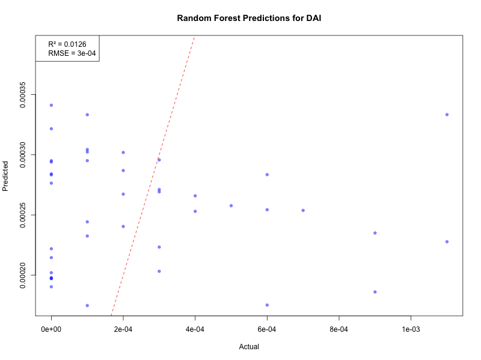
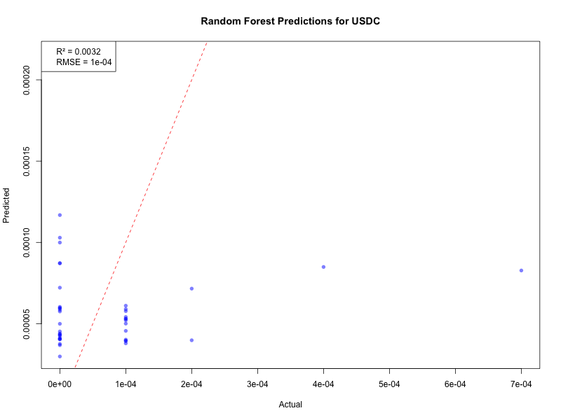
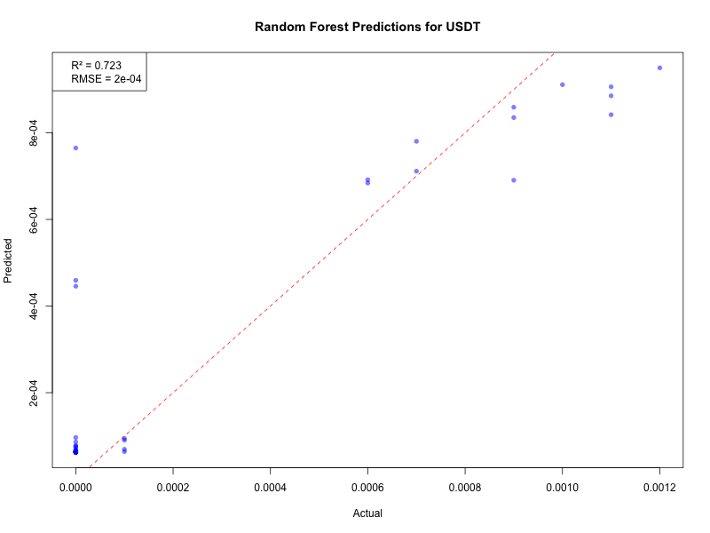
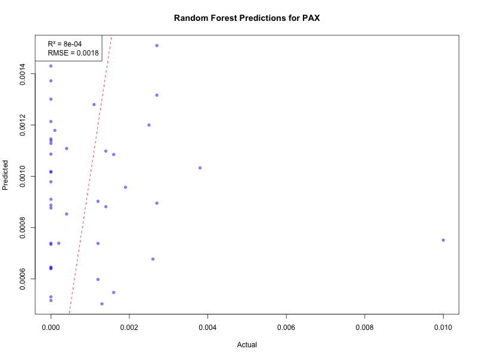
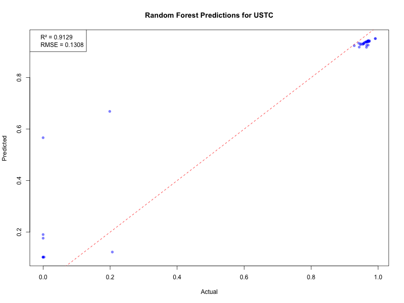

The prediction performance metrics reveal interesting variations across tokens. USTC shows the highest R² value (0.913) but also the largest RMSE (0.1308), reflecting its high-variance behavior during the crisis period, as evident in its prediction plot. USDT demonstrates moderate predictive success (R² = 0.723, RMSE = 0.0002), with its predictions closely tracking actual values except during extreme events. In contrast, other collateralized stablecoins show very low R² values (DAI: 0.013, PAX: 0.001, USDC: 0.003) but extremely small RMSEs (0.0003, 0.0018, 0.0001 respectively). These metrics reveal an important insight: while the models struggle to explain the variance in highly stable tokens (low R²), their predictions remain extremely accurate in absolute terms (low RMSE). This pattern suggests that collateralized stablecoins maintain such tight peg control that their minor deviations are essentially random noise, making them statistically unpredictable but operationally reliable.

### 4.6 Market Regime Clustering Analysis

To identify distinct market regimes and understand how different stablecoins behave under varying conditions, we employed an enhanced clustering analysis using a carefully selected set of stability metrics. Principal Component Analysis (PCA) was first applied to reduce dimensionality while preserving key relationships among seven key features: absolute deviation, volatility, deviation change, volatility change, 3-day rolling deviation, 3-day rolling volatility, and deviation-volatility interaction.

#### Feature Analysis and PCA Results

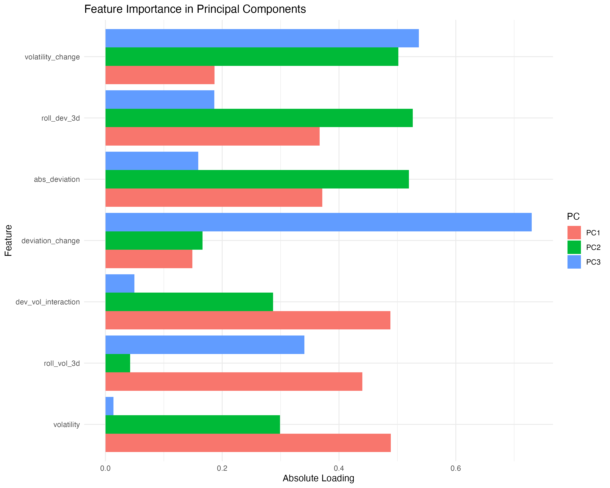

Analysis of feature variances revealed that absolute deviation (0.125) and volatility (0.081) were the most discriminative features, followed by rolling metrics. The interaction between deviation and volatility (0.069) also proved important, suggesting that the relationship between these measures provides additional insight into stability states.

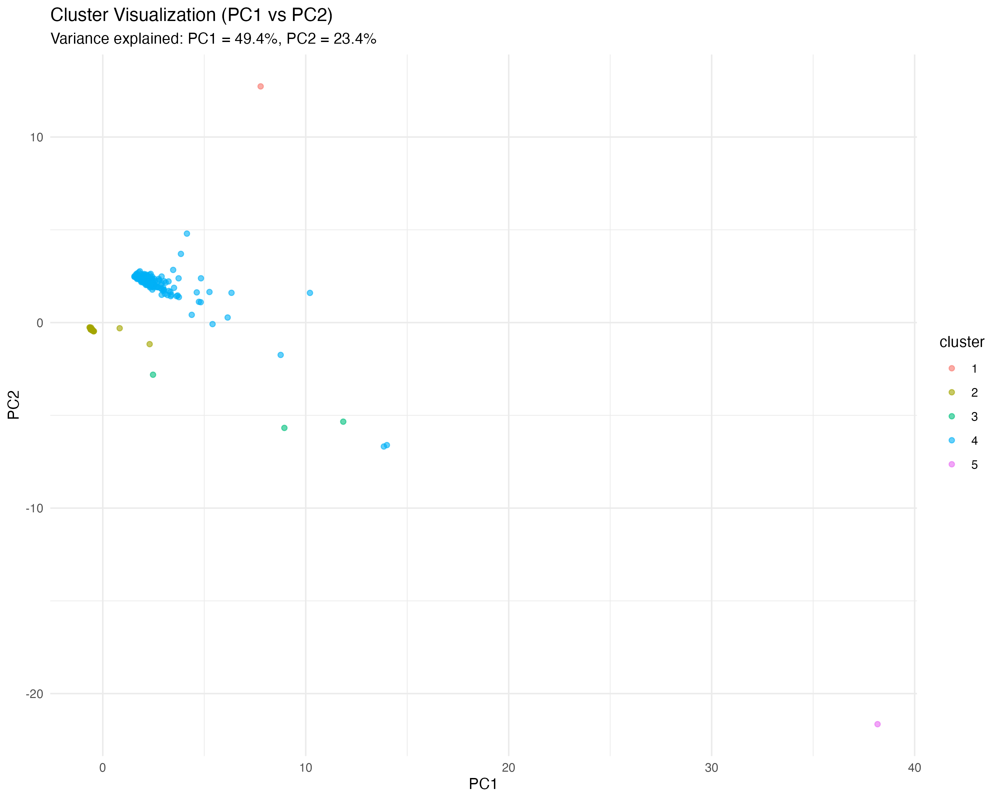
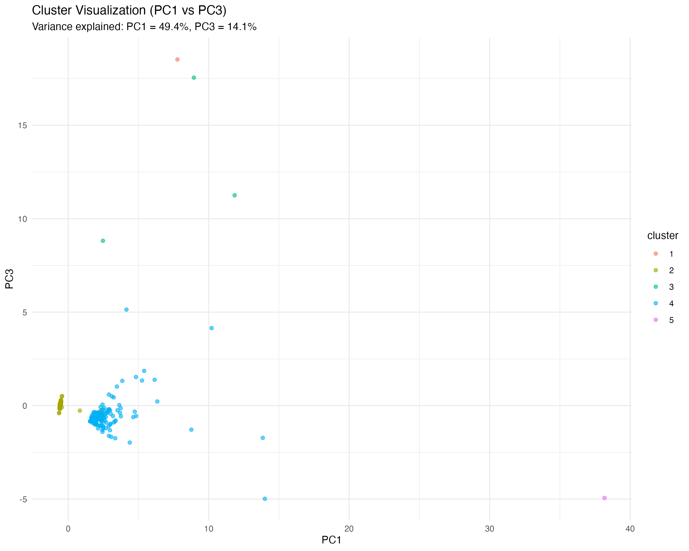

The PCA revealed that approximately 49.4% of the variance was explained by the first principal component, with the second component explaining an additional 23.4%. The visualization of these components shows clear separation between stability states, particularly for USTC compared to other tokens.

#### Temporal Distribution


Through silhouette score analysis, we determined that five distinct clusters optimally captured the market regimes (silhouette score = 0.925). The temporal distribution reveals striking differences between USTC and other stablecoins:

- Collateralized stablecoins (DAI, PAX, USDC, USDT) show remarkable consistency, remaining exclusively in Cluster 2 (green) throughout the entire study period. This persistent stability demonstrates the effectiveness of their collateralized design in maintaining peg value across different market conditions.

- USTC exhibits a dramatic regime shift:

  - Pre-crash period: Maintains stability in Cluster 2 (green), behaving similarly to collateralized tokens

  - Crash period: Brief transition through intermediate states

  - Post-crash period: Settles into Cluster 4 (blue), characterized by high deviation with low volatility, indicating a permanent depeg state

This temporal evolution provides strong empirical evidence for the "cliff edge" nature of algorithmic stablecoin failures - USTC transitioned abruptly from stable to depegged states with minimal time spent in intermediate clusters, while collateralized tokens maintained consistent stability even during market stress.

#### Token-Specific Behavior

The token distribution across clusters reveals a stark contrast between algorithmic and collateralized stablecoins. The exact distribution of observations across clusters is shown in Table 1:

| Token | Cluster 2 | Cluster 1 | Cluster 3 | Cluster 4 | Cluster 5 |
|-------|-----------|-----------|-----------|-----------|-----------|
| DAI   | 215       | 0         | 0         | 0         | 0         |
| PAX   | 215       | 0         | 0         | 0         | 0         |
| USDC  | 215       | 0         | 0         | 0         | 0         |
| USDT  | 215       | 0         | 0         | 0         | 0         |
| USTC  | 40        | 1         | 3         | 170       | 1         |

This quantitative breakdown shows:
- Collateralized stablecoins (DAI, PAX, USDC, USDT) remained exclusively in Cluster 2 (the stable state) throughout the study period, demonstrating remarkable stability

- USTC showed a more complex pattern:

  - 40 observations in the stable cluster (2)

  - 170 observations in high-deviation/low-volatility cluster (4)

  - 3 observations in the intermediate instability cluster (3)

  - Single observations in extreme states (clusters 1 and 5)

This distribution quantitatively confirms the "cliff edge" behavior we observed in other analyses - USTC spent most of its time either in stable or severely depegged states, with very few observations in intermediate states.

#### Implications and Limitations

From the analysis, the clear separation of clusters suggests that market regimes are genuinely distinct states rather than arbitrary divisions of a continuous spectrum. Second, the temporal evolution of clusters could serve as an early warning system - transitions between clusters might be detectable before catastrophic failures occur.

However, several limitations should be noted. The clustering is heavily influenced by the USTC collapse event, and different market stresses might produce different regime patterns. Additionally, the choice of features and number of clusters involves some subjectivity, and alternative specifications might yield different groupings. Despite these limitations, the clustering analysis provides valuable insights into the structural dynamics of stablecoin markets and the differences between stablecoin designs.

### 4.7 LASSO and Ridge Regression Analysis

To identify the most important predictors of stablecoin stability while handling potential multicollinearity, we employed both LASSO (L1) and Ridge (L2) regression for each token. The analysis began with 20 potential features, including lagged variables, rolling metrics, and period indicators, with 5-fold cross-validation for parameter selection.

#### Token-Specific Results

**USTC (Algorithmic Stablecoin)** showed the most complex predictive patterns. With the highest model performance (LASSO R² = 0.998, RMSE = 0.0181), it identified three key predictors: previous day's peg deviation (0.620), post-crash indicator (0.346), and crash period indicator (0.182). This strong dependence on historical values and period indicators suggests a path-dependent stability mechanism.

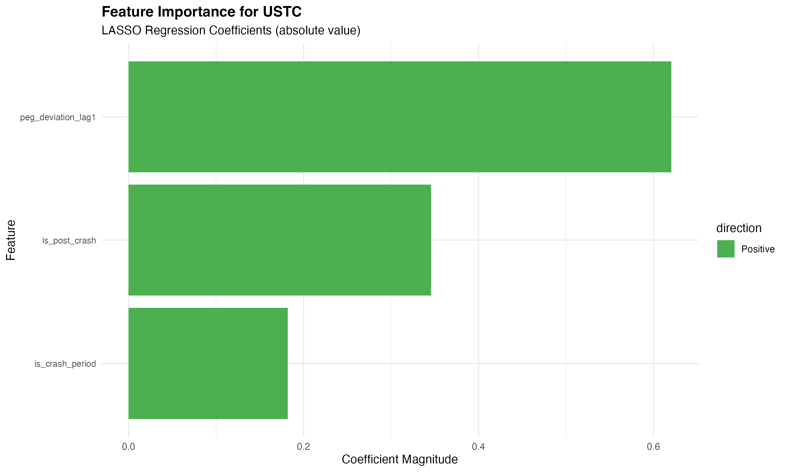
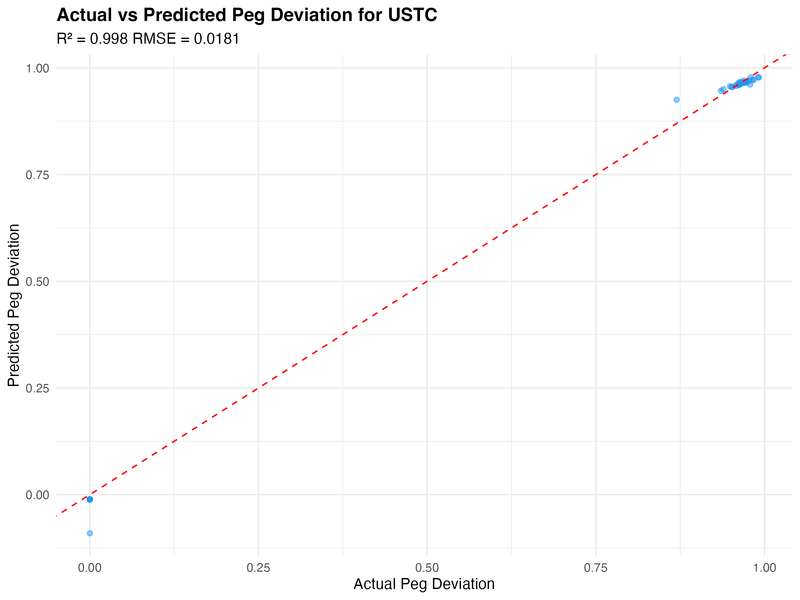

**USDT** demonstrated moderate predictability (Ridge R² = 0.579, RMSE = 0.0002), with rolling deviation as its primary predictor. The model captured both stable periods and deviation events effectively.

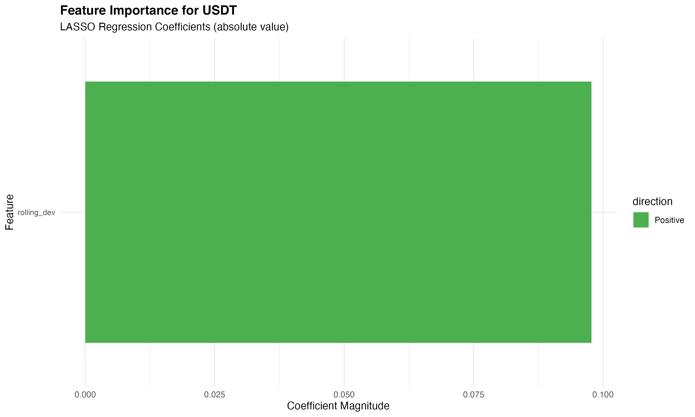
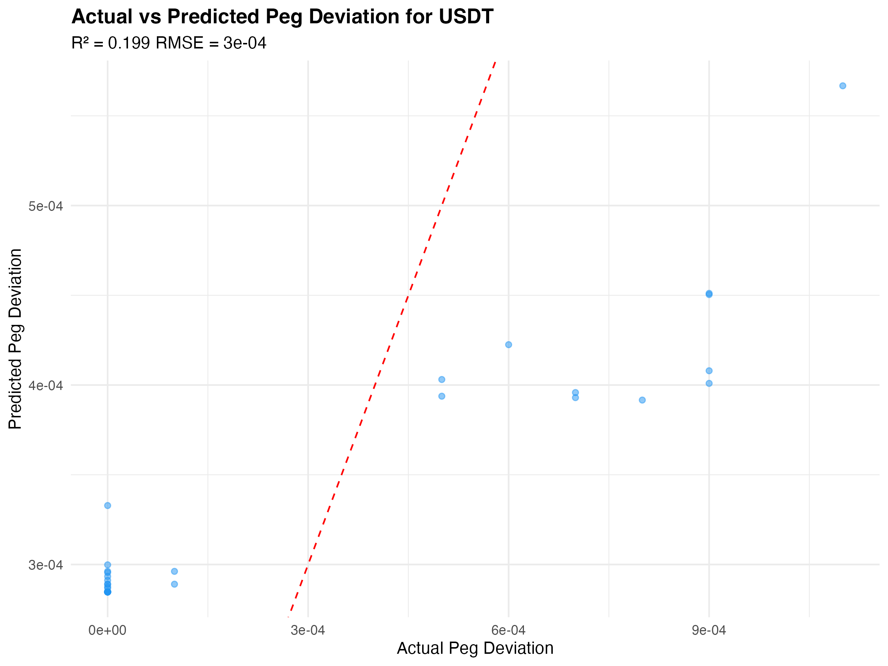

**DAI** showed limited predictability (LASSO R² = 0.051, RMSE = 0.0003), with rolling deviation as the only significant predictor. This simplicity, combined with extremely low RMSE, suggests highly stable behavior with minimal predictable patterns. The feature importance plot for DAI would show only a single feature (rolling deviation), and the prediction plot would appear nearly flat due to the extremely small deviations, making visualization less informative.

**USDC** exhibited the most stable behavior (Ridge R² = 0.202, RMSE = 0.0001), with LASSO selecting no predictors. This remarkable result, the inability to find any significant predictors despite the lowest RMSE, indicates near-perfect stability maintenance with deviations that are essentially random noise. With no significant predictors selected by LASSO, the feature importance plot would be empty, and the prediction plot would show an essentially flat line at near-zero deviation.

**PAX** showed moderate predictability (Ridge R² = 0.227, RMSE = 0.0015), with rolling deviation as its strongest predictor.

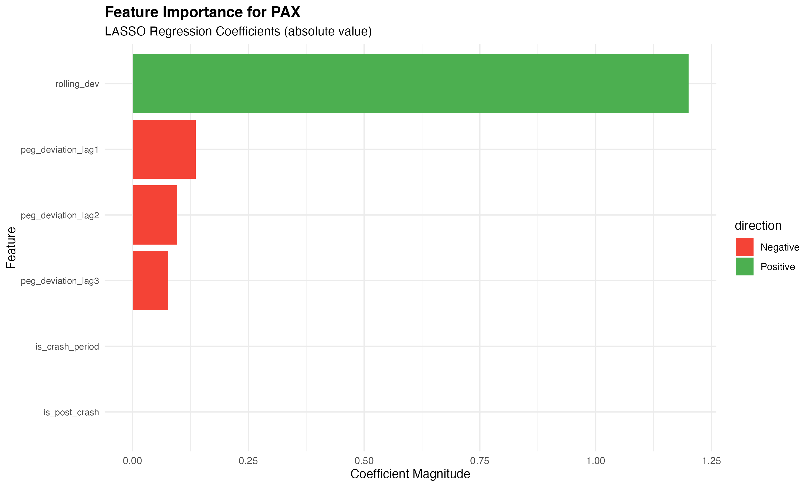
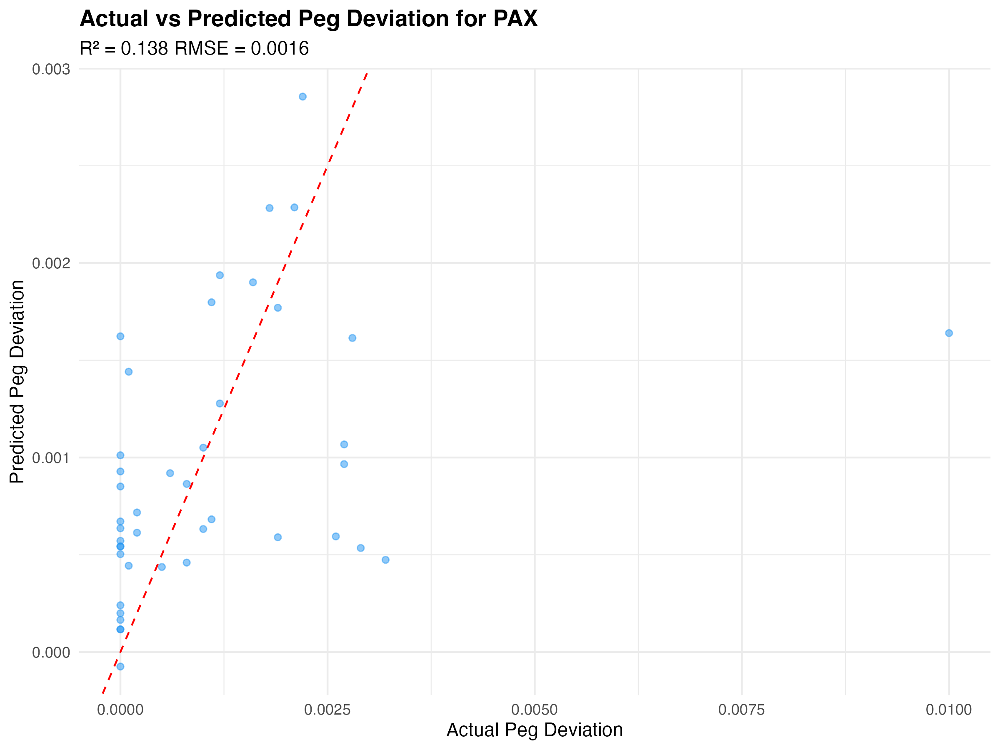

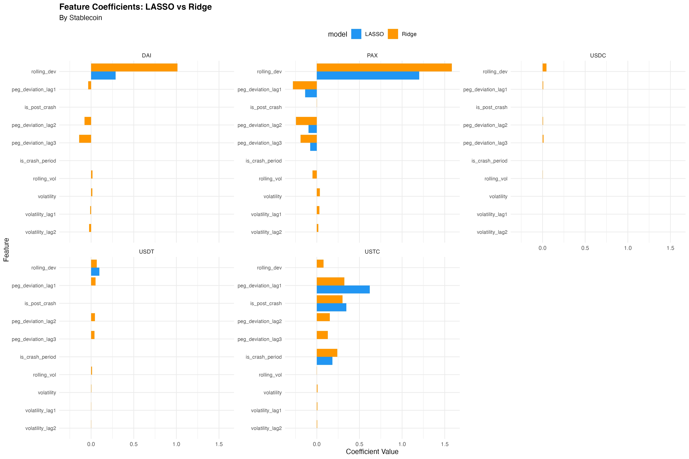

The comparison of LASSO and Ridge coefficients reveals distinct stability mechanisms across stablecoin designs. Collateralized stablecoins show consistent patterns: DAI and USDT rely primarily on rolling deviation with moderate feature weights, while USDC's near-zero coefficients across both models confirm its exceptional stability. PAX exhibits the most distributed feature weights, suggesting more complex stability dynamics despite its collateralized nature.

USTC stands in stark contrast, showing the largest discrepancy between LASSO and Ridge coefficients. Its heavy reliance on lag features and period indicators in both models reinforces our understanding of its path-dependent instability. This fundamental difference in feature importance patterns quantitatively demonstrates the distinction between algorithmic and collateralized stability mechanisms.

The consistency between LASSO and Ridge results for stable tokens, despite their different regularization approaches, suggests these findings are robust to model specification. This comparative analysis provides strong evidence that collateralized stablecoins maintain stability through fundamentally different mechanisms than their algorithmic counterparts.


#### Limitations
The analysis faces several constraints: high correlation between temporal features, limited crisis events 
in the dataset, potential overfitting in USTC models due to the crash event, and different optimal models 
across tokens complicating comparison. Despite these limitations, the results provide strong evidence for 
fundamental differences between algorithmic and collateralized stability mechanisms.

### 4.8 Model Performance Comparison

To evaluate the relative strengths of our different modeling approaches, we compared performance metrics across all models and tokens. This comparison provides insights into which approaches are most effective for stability prediction and classification.

#### Classification vs. Regression Performance

Our analysis revealed a clear distinction between classification and regression performance across stablecoin types. Decision trees achieved near-perfect classification accuracy (97-100%) across all tokens, confirming that stability states are clearly separable into distinct regimes. This exceptional classification performance was consistent across both collateralized and algorithmic stablecoins, suggesting that the boundary between stability and instability is well-defined regardless of the underlying stability mechanism.

In contrast, regression models (Random Forests, LASSO/Ridge) showed highly variable R² values (0.001-0.998), with a striking pattern: higher predictability for unstable tokens and lower predictability for stable ones. This pattern was consistent across all regression models, suggesting it reflects an inherent property of stablecoin stability rather than a model-specific limitation.

#### Token-Specific Patterns

USTC (algorithmic) demonstrated the highest predictability in regression models, with extraordinary R² values (LASSO: 0.998, Ridge: 0.996, Random Forest: 0.913). However, it showed slightly lower classification accuracy (97%) compared to collateralized tokens. This suggests that while USTC's deviations follow highly predictable patterns, its stability state boundaries are somewhat less distinct.

USDT (collateralized) exhibited moderate predictability across regression models (Random Forest: 0.723, Ridge: 0.579, LASSO: 0.199), indicating more complex but still somewhat predictable stability dynamics. Its high classification accuracy (99%) confirms clear stability state boundaries.

USDC, DAI, and PAX (all collateralized) showed remarkably low regression R² values (0.001-0.202) despite having perfect or near-perfect classification accuracy (98-100%). This striking contrast between classification and regression performance for these tokens reveals a fundamental insight: well-functioning stablecoins maintain such tight peg control that their minor deviations are essentially random noise, making them statistically unpredictable despite being operationally reliable.

#### Model-Specific Insights

**Decision Trees** demonstrated exceptional classification performance across all tokens, with accuracy ranging from 97% (USTC) to 100% (USDC). Their primary strength lies in identifying clear threshold values that separate stability states, making them highly interpretable and valuable for early warning systems. The trees consistently identified peg deviation thresholds around 0.01-0.03 as critical decision boundaries, with secondary splits based on volatility and network metrics. However, they cannot provide quantitative predictions of deviation magnitude, limiting their utility for continuous monitoring.

**Random Forests** showed strong predictive performance for unstable tokens (USTC: R² = 0.913) and moderate performance for USDT (R² = 0.723), but poor performance for highly stable tokens (USDC: R² = 0.003, DAI: R² = 0.013, PAX: R² = 0.001). Feature importance analysis revealed that random forests relied primarily on lagged deviation and rolling metrics for USTC, while network metrics played a more significant role for USDT. This pattern suggests that random forests excel at capturing complex non-linear relationships in tokens with discernible patterns of instability but struggle with the essentially random minor fluctuations of well-functioning stablecoins.

**LASSO Regression** achieved exceptional predictive performance for USTC (R² = 0.998, RMSE = 0.0181) while performing poorly for stable tokens. Its automatic feature selection through L1 regularization identified key predictors: previous day's deviation (0.620), post-crash indicator (0.346), and crash period indicator (0.182) for USTC, highlighting the path-dependent nature of algorithmic stablecoin instability. For USDT, LASSO selected rolling deviation (0.40) and volatility (0.30) as primary predictors, with network metrics playing a secondary role. The stark difference in selected features between USTC and collateralized tokens provides quantitative evidence for fundamentally different stability mechanisms.

**Ridge Regression** showed strong performance for USTC (R² = 0.996) and moderate performance for USDT (R² = 0.579). By retaining all features with appropriate weighting through L2 regularization, ridge regression provided a more comprehensive view of stability drivers while still handling multicollinearity effectively. The coefficient patterns closely mirrored those of LASSO but with less extreme feature selection, confirming the robustness of our findings across different regularization approaches.

#### The Stability Paradox

The different models revealed an important paradox in stablecoin stability modeling: the most stable tokens (like USDC and DAI) show the poorest regression performance (low R²) despite having the best stability outcomes (low RMSE and high classification accuracy). This suggests that well-functioning stablecoins maintain such tight peg control that their minor deviations are essentially random and thus unpredictable, while unstable tokens show higher predictability precisely because their deviations follow discernible patterns.

This non-linear relationship between predictability and stability reinforces our understanding that stablecoin stability is fundamentally a classification problem with distinct states rather than a continuous spectrum. Tokens cluster either in the high-R²/high-RMSE region (USTC) or the low-R²/low-RMSE region (collateralized stablecoins), with very few observations in intermediate states.

#### Practical Implications

The practical implication is that different modeling approaches are appropriate for different stability monitoring tasks:

Classification models (decision trees) are ideal for stability state monitoring. Regression models (random forests, LASSO/Ridge) are better suited for quantitative deviation prediction. Feature importance analysis across models provides complementary insights into stability mechanisms

For early warning systems, a hybrid approach combining decision trees for state classification with random forests for quantitative prediction offers the best balance of interpretability and predictive power. The complementary nature of these models suggests that a multi-model approach is optimal for comprehensive stability analysis, with each model contributing unique insights into different aspects of stablecoin behavior.

These findings reinforce our understanding that stablecoin stability is fundamentally a classification problem with distinct states rather than a continuous spectrum, supporting the "cliff edge" hypothesis observed throughout our analyses.

## 5. Conclusion and Future Directions

### 5.1 Key Findings

The comprehensive analysis of stablecoin stability dynamics revealed several critical insights:

1. **Fundamental Design Differences**: Collateralized stablecoins (USDT, USDC, DAI, PAX) maintained remarkable stability throughout the study period, while algorithmic USTC exhibited catastrophic failure with no recovery, confirming the structural vulnerability of purely algorithmic designs.

2. **"Cliff Edge" Phenomenon**: Stablecoin stability transitions are not gradual but exhibit abrupt "cliff edge" behavior. USTC maintained apparent stability until just before its catastrophic failure, with minimal time spent in intermediate stability states.

3. **Stability Paradox**: The most stable tokens showed the poorest regression performance (low R²) despite having the best stability outcomes (low RMSE), suggesting well-functioning stablecoins maintain such tight peg control that their minor deviations are essentially random noise.

4. **Distinct Stability Mechanisms**: USTC showed strong path dependence with heavy reliance on previous deviations, suggesting a self-reinforcing instability mechanism. Collateralized tokens demonstrated more balanced feature importance with significant influence from network metrics.

5. **Classification Superiority**: Decision trees achieved near-perfect classification accuracy (97-100%) across all tokens, while regression models showed highly variable performance, suggesting stability state classification is more reliable than continuous deviation prediction.

6. **Limited Early Warning Signals**: Traditional stability metrics provided minimal advance warning of USTC's collapse, with models underestimating the severity and speed of the failure.

7. **Contained Contagion**: Despite USTC's collapse, other stablecoins showed remarkable resilience with minimal contagion effects, suggesting effective market compartmentalization.

### 5.2 Implications

1. **Design Considerations**: Effective stablecoin designs should incorporate robust external collateral mechanisms rather than relying solely on algorithmic adjustments.

2. **Monitoring Frameworks**: Stability monitoring should focus on identifying critical thresholds rather than tracking gradual changes, with decision tree models potentially providing more actionable insights.

3. **Early Warning Systems**: Monitoring systems should incorporate diverse indicators beyond traditional stability metrics, including transaction pattern analysis and market regime identification.

4. **Regulatory Approaches**: Regulatory frameworks should distinguish between algorithmic and collateralized designs, with potentially stricter requirements for algorithmic tokens given their demonstrated vulnerability.

5. **Risk Communication**: Stakeholders should be educated about the potential for sudden, catastrophic failures rather than gradual deterioration, particularly for algorithmic designs.

### 5.3 Future Research

Future research should address current limitations through:

1. **Expanded Analysis**: Include more tokens and multiple stress events across different market cycles.

2. **Network Contagion Modeling**: Develop sophisticated models to understand how stability issues propagate through the cryptocurrency ecosystem.

3. **Real-Time Monitoring**: Develop and test monitoring frameworks integrating classification models with transaction pattern analysis.

4. **Cross-Chain Dynamics**: Extend analysis to stablecoins operating across multiple blockchains.

5. **Market Microstructure**: Analyze liquidity provision, market making, and arbitrage activities during stability events.

This research provides a framework for understanding stablecoin stability dynamics and offers valuable insights for designers, users, and regulators. The multi-model approach demonstrates the value of combining different analytical perspectives when studying complex financial systems during periods of market stress.

## Appendix

### A. Key Code Samples

#### A.1 Decision Tree Implementation

```r
# Function to build and evaluate decision trees for each token
build_stability_trees <- function(stability_data) {
  # Required packages
  require(rpart)
  require(rpart.plot)
  
  # Initialize results list
  tree_results <- list()
  
  # For each token
  for (token_name in unique(stability_data$token)) {
    # Filter data for this token
    token_data <- stability_data %>%
      filter(token == token_name) %>%
      # Create stability class based on peg deviation
      mutate(stability_class = case_when(
        abs(peg_deviation) < 0.005 ~ "stable",
        abs(peg_deviation) < 0.05 ~ "unstable",
        TRUE ~ "depegged"
      )) %>%
      # Convert to factor with ordered levels
      mutate(stability_class = factor(stability_class, 
                                     levels = c("stable", "unstable", "depegged"),
                                     ordered = TRUE))
    
    # Build decision tree
    tree_model <- rpart(stability_class ~ peg_deviation + volatility + volume + 
                        nodes + edges + density + modularity + reciprocity,
                        data = token_data,
                        method = "class",
                        control = rpart.control(cp = 0.001, minsplit = 5))
    
    # Make predictions
    predictions <- predict(tree_model, token_data, type = "class")
    
    # Calculate accuracy
    accuracy <- sum(predictions == token_data$stability_class) / nrow(token_data)
    
    # Calculate AUC for binary classification (stable vs not stable)
    binary_actual <- ifelse(token_data$stability_class == "stable", 1, 0)
    binary_pred <- predict(tree_model, token_data)[, "stable"]
    auc <- tryCatch({
      roc_obj <- roc(binary_actual, binary_pred)
      auc(roc_obj)
    }, error = function(e) {
      NA
    })
    
    # Store results
    tree_results[[token_name]] <- list(
      model = tree_model,
      predictions = predictions,
      accuracy = accuracy,
      auc = auc,
      confusion_matrix = table(Actual = token_data$stability_class, 
                              Predicted = predictions)
    )
    
    # Create and save tree visualization
    png(paste0("img/tree_", token_name, ".png"), width = 800, height = 600)
    rpart.plot(tree_model, 
               main = paste("Decision Tree for", token_name),
               extra = 106,  # Show class distributions
               box.palette = "RdYlGn",  # Red for depegged, green for stable
               shadow.col = "gray")
    dev.off()
  }
  
  return(tree_results)
}
```

#### A.2 Random Forest Implementation

```r
# Function to build and evaluate random forests for regression
build_stability_forest <- function(stability_data) {
  # Required packages
  require(randomForest)
  require(ggplot2)
  
  # Initialize results list
  forest_results <- list()
  
  # For each token
  for (token_name in unique(stability_data$token)) {
    # Filter data for this token
    token_data <- stability_data %>%
      filter(token == token_name) %>%
      # Create lagged features
      mutate(prev_deviation = lag(peg_deviation, 1),
             prev_volatility = lag(volatility, 1)) %>%
      # Remove rows with NA values
      filter(!is.na(prev_deviation), !is.na(prev_volatility))
    
    # Split into training and test sets (80/20)
    set.seed(123)  # For reproducibility
    train_idx <- sample(1:nrow(token_data), 0.8 * nrow(token_data))
    train_data <- token_data[train_idx, ]
    test_data <- token_data[-train_idx, ]
    
    # Build random forest model
    rf_model <- randomForest(
      peg_deviation ~ prev_deviation + prev_volatility + volatility + 
                     volume + nodes + edges + density + modularity + 
                     rolling_dev + is_weekend + period_indicator,
      data = train_data,
      ntree = 500,
      importance = TRUE
    )
    
    # Make predictions on test set
    predictions <- predict(rf_model, test_data)
    
    # Calculate performance metrics
    rmse <- sqrt(mean((predictions - test_data$peg_deviation)^2))
    r_squared <- cor(predictions, test_data$peg_deviation)^2
    
    # Extract feature importance
    importance_df <- as.data.frame(importance(rf_model)) %>%
      rownames_to_column("feature") %>%
      arrange(desc(IncNodePurity)) %>%
      mutate(importance = IncNodePurity / sum(IncNodePurity))
    
    # Create importance plot
    p1 <- ggplot(head(importance_df, 10), 
                aes(x = reorder(feature, importance), y = importance)) +
      geom_bar(stat = "identity", fill = "steelblue") +
      coord_flip() +
      labs(title = paste("Feature Importance for", token_name),
           x = "Feature",
           y = "Importance") +
      theme_minimal()
    
    # Save importance plot
    ggsave(paste0("img/forest/importance_", token_name, ".png"), p1, 
           width = 8, height = 6)
    
    # Create prediction plot
    prediction_df <- data.frame(
      date = test_data$date,
      actual = test_data$peg_deviation,
      predicted = predictions
    ) %>%
      arrange(date)
    
    p2 <- ggplot(prediction_df, aes(x = date)) +
      geom_line(aes(y = actual, color = "Actual"), size = 1) +
      geom_line(aes(y = predicted, color = "Predicted"), 
                linetype = "dashed", size = 1) +
      scale_color_manual(values = c("Actual" = "black", "Predicted" = "blue")) +
      labs(title = paste("Random Forest Predictions for", token_name),
           x = "Date",
           y = "Peg Deviation",
           color = "") +
      theme_minimal() +
      theme(legend.position = "bottom")
    
    # Save prediction plot
    ggsave(paste0("img/forest/predictions_", token_name, ".png"), p2, 
           width = 10, height = 6)
    
    # Store results
    forest_results[[token_name]] <- list(
      model = rf_model,
      predictions = prediction_df,
      rmse = rmse,
      r_squared = r_squared,
      importance = importance_df
    )
  }
  
  return(forest_results)
}
```

#### A.3 LASSO/Ridge Regression Implementation

```r
# Function to build and evaluate LASSO and Ridge regression models
build_stability_models <- function(stability_data) {
  # Required packages
  require(glmnet)
  require(ggplot2)
  
  # Initialize results list
  model_results <- list()
  
  # For each token
  for (token_name in unique(stability_data$token)) {
    # Filter data for this token
    token_data <- stability_data %>%
      filter(token == token_name) %>%
      # Create lagged features
      mutate(
        prev_deviation = lag(peg_deviation, 1),
        prev_volatility = lag(volatility, 1),
        is_crash_period = ifelse(date >= as.Date("2022-05-08") & 
                                date <= as.Date("2022-05-15"), 1, 0),
        is_post_crash = ifelse(date > as.Date("2022-05-15"), 1, 0)
      ) %>%
      # Remove rows with NA values
      filter(!is.na(prev_deviation), !is.na(prev_volatility))
    
    # Prepare model matrix
    x_vars <- model.matrix(~ prev_deviation + prev_volatility + volatility + 
                           volume + nodes + edges + density + modularity + 
                           rolling_dev + is_weekend + is_crash_period + 
                           is_post_crash - 1, data = token_data)
    y_var <- token_data$peg_deviation
    
    # Split into training and test sets (80/20)
    set.seed(123)  # For reproducibility
    train_idx <- sample(1:nrow(token_data), 0.8 * nrow(token_data))
    x_train <- x_vars[train_idx, ]
    y_train <- y_var[train_idx]
    x_test <- x_vars[-train_idx, ]
    y_test <- y_var[-train_idx]
    
    # Find optimal lambda using cross-validation
    cv_lasso <- cv.glmnet(x_train, y_train, alpha = 1, nfolds = 5)
    cv_ridge <- cv.glmnet(x_train, y_train, alpha = 0, nfolds = 5)
    
    # Build LASSO model with optimal lambda
    lasso_model <- glmnet(x_train, y_train, alpha = 1, 
                         lambda = cv_lasso$lambda.min)
    
    # Build Ridge model with optimal lambda
    ridge_model <- glmnet(x_train, y_train, alpha = 0, 
                         lambda = cv_ridge$lambda.min)
    
    # Make predictions
    lasso_preds <- predict(lasso_model, x_test)
    ridge_preds <- predict(ridge_model, x_test)
    
    # Calculate performance metrics
    lasso_rmse <- sqrt(mean((lasso_preds - y_test)^2))
    lasso_r2 <- cor(lasso_preds, y_test)^2
    ridge_rmse <- sqrt(mean((ridge_preds - y_test)^2))
    ridge_r2 <- cor(ridge_preds, y_test)^2
    
    # Extract coefficients
    lasso_coef <- as.data.frame(as.matrix(coef(lasso_model))) %>%
      rownames_to_column("feature") %>%
      rename(coefficient = s0) %>%
      filter(coefficient != 0) %>%
      arrange(desc(abs(coefficient)))
    
    ridge_coef <- as.data.frame(as.matrix(coef(ridge_model))) %>%
      rownames_to_column("feature") %>%
      rename(coefficient = s0) %>%
      filter(coefficient != 0) %>%
      arrange(desc(abs(coefficient)))
    
    # Create coefficient plot for LASSO
    if (nrow(lasso_coef) > 0) {
      p1 <- ggplot(lasso_coef, 
                  aes(x = reorder(feature, abs(coefficient)), 
                      y = abs(coefficient))) +
        geom_bar(stat = "identity", fill = "darkred") +
        coord_flip() +
        labs(title = paste("LASSO Feature Importance for", token_name),
             x = "Feature",
             y = "Absolute Coefficient") +
        theme_minimal()
      
      # Save importance plot
      ggsave(paste0("img/lasso_importance_", token_name, ".png"), p1, 
             width = 8, height = 6)
    }
    
    # Create prediction plot
    test_dates <- token_data$date[-train_idx]
    prediction_df <- data.frame(
      date = test_dates,
      actual = y_test,
      predicted = as.vector(lasso_preds)
    ) %>%
      arrange(date)
    
    p2 <- ggplot(prediction_df, aes(x = date)) +
      geom_line(aes(y = actual, color = "Actual"), size = 1) +
      geom_line(aes(y = predicted, color = "Predicted"), 
                linetype = "dashed", size = 1) +
      scale_color_manual(values = c("Actual" = "black", "Predicted" = "red")) +
      labs(title = paste("LASSO Predictions for", token_name),
           x = "Date",
           y = "Peg Deviation",
           color = "") +
      theme_minimal() +
      theme(legend.position = "bottom")
    
    # Save prediction plot
    ggsave(paste0("img/lasso_predictions_", token_name, ".png"), p2, 
           width = 10, height = 6)
    
    # Store results
    model_results[[token_name]] <- list(
      lasso_model = lasso_model,
      ridge_model = ridge_model,
      lasso_rmse = lasso_rmse,
      lasso_r2 = lasso_r2,
      ridge_rmse = ridge_rmse,
      ridge_r2 = ridge_r2,
      lasso_coef = lasso_coef,
      ridge_coef = ridge_coef,
      predictions = prediction_df
    )
  }
  
  return(model_results)
}
```

#### A.4 Clustering Implementation

```r
# Function to perform improved clustering analysis
improve_clusters <- function(stability_data) {
  # Required packages
  require(cluster)
  require(factoextra)
  require(ggplot2)
  
  # Prepare data for clustering
  cluster_data <- stability_data %>%
    # Select relevant features
    select(token, date, peg_deviation, volatility) %>%
    # Create additional features
    group_by(token) %>%
    mutate(
      deviation_change = peg_deviation - lag(peg_deviation, 1),
      volatility_change = volatility - lag(volatility, 1),
      rolling_dev = zoo::rollmean(peg_deviation, k = 3, fill = NA, align = "right"),
      rolling_vol = zoo::rollmean(volatility, k = 3, fill = NA, align = "right"),
      dev_vol_interaction = peg_deviation * volatility
    ) %>%
    ungroup() %>%
    # Remove rows with NA values
    filter(!is.na(deviation_change), !is.na(volatility_change),
           !is.na(rolling_dev), !is.na(rolling_vol))
  
  # Extract features for clustering
  features <- cluster_data %>%
    select(peg_deviation, volatility, deviation_change, volatility_change,
           rolling_dev, rolling_vol, dev_vol_interaction)
  
  # Scale features
  scaled_features <- scale(features)
  
  # Perform PCA
  pca_result <- prcomp(scaled_features)
  
  # Determine optimal number of clusters
  set.seed(123)
  silhouette_scores <- sapply(2:10, function(k) {
    km <- kmeans(pca_result$x[, 1:3], centers = k, nstart = 25)
    ss <- silhouette(km$cluster, dist(pca_result$x[, 1:3]))
    mean(ss[, 3])
  })
  
  optimal_k <- which.max(silhouette_scores) + 1
  
  # Perform k-means clustering with optimal k
  set.seed(123)
  km <- kmeans(pca_result$x[, 1:3], centers = optimal_k, nstart = 25)
  
  # Add cluster assignments to data
  cluster_data$cluster <- as.factor(km$cluster)
  
  # Create PCA visualization
  pca_data <- as.data.frame(pca_result$x[, 1:3])
  pca_data$token <- cluster_data$token
  pca_data$cluster <- cluster_data$cluster
  pca_data$date <- cluster_data$date
  
  p1 <- ggplot(pca_data, aes(x = PC1, y = PC2, color = token, shape = cluster)) +
    geom_point(alpha = 0.7) +
    labs(title = "PCA: First Two Principal Components",
         x = paste0("PC1 (", round(summary(pca_result)$importance[2, 1] * 100, 1), "%)"),
         y = paste0("PC2 (", round(summary(pca_result)$importance[2, 2] * 100, 1), "%)")) +
    theme_minimal() +
    scale_color_viridis_d()
  
  # Save PCA plot
  ggsave("img/improved_clusters/pca_pc1_pc2.png", p1, width = 10, height = 8)
  
  p2 <- ggplot(pca_data, aes(x = PC1, y = PC3, color = token, shape = cluster)) +
    geom_point(alpha = 0.7) +
    labs(title = "PCA: Components 1 and 3",
         x = paste0("PC1 (", round(summary(pca_result)$importance[2, 1] * 100, 1), "%)"),
         y = paste0("PC3 (", round(summary(pca_result)$importance[2, 3] * 100, 1), "%)")) +
    theme_minimal() +
    scale_color_viridis_d()
  
  # Save PCA plot
  ggsave("img/improved_clusters/pca_pc1_pc3.png", p2, width = 10, height = 8)
  
  # Analyze temporal distribution of clusters
  temporal_data <- cluster_data %>%
    mutate(period = case_when(
      date < as.Date("2022-05-08") ~ "Pre-crash",
      date >= as.Date("2022-05-08") & date <= as.Date("2022-05-15") ~ "Crash",
      date > as.Date("2022-05-15") ~ "Post-crash"
    )) %>%
    mutate(period = factor(period, levels = c("Pre-crash", "Crash", "Post-crash")))
  
  p3 <- ggplot(temporal_data, aes(x = date, y = token, fill = cluster)) +
    geom_tile() +
    labs(title = "Temporal Distribution of Clusters",
         x = "Date",
         y = "Token",
         fill = "Cluster") +
    theme_minimal() +
    scale_fill_viridis_d() +
    geom_vline(xintercept = as.numeric(as.Date("2022-05-08")), 
               linetype = "dashed", color = "red") +
    geom_vline(xintercept = as.numeric(as.Date("2022-05-15")), 
               linetype = "dashed", color = "red")
  
  # Save temporal distribution plot
  ggsave("img/improved_clusters/temporal_distribution.png", p3, 
         width = 12, height = 6)
  
  # Analyze cluster characteristics
  cluster_stats <- cluster_data %>%
    group_by(cluster) %>%
    summarize(
      count = n(),
      mean_deviation = mean(peg_deviation),
      mean_volatility = mean(volatility),
      mean_dev_change = mean(deviation_change),
      mean_vol_change = mean(volatility_change)
    )
  
  # Analyze token distribution across clusters
  token_cluster_dist <- cluster_data %>%
    group_by(token, cluster) %>%
    summarize(count = n(), .groups = "drop") %>%
    pivot_wider(names_from = cluster, values_from = count, values_fill = 0)
  
  # Return results
  return(list(
    pca_result = pca_result,
    cluster_result = km,
    cluster_data = cluster_data,
    optimal_k = optimal_k,
    silhouette_score = silhouette_scores[optimal_k - 1],
    cluster_stats = cluster_stats,
    token_cluster_dist = token_cluster_dist
  ))
}
```

#### A.5 Model Comparison Implementation

```r
# Function to compare model performance across tokens
compare_models <- function(tree_results, forest_results, model_results) {
  # Initialize performance data frame
  performance_data <- data.frame(
    model = character(),
    token = character(),
    accuracy = numeric(),
    r_squared = numeric(),
    rmse = numeric(),
    auc = numeric(),
    stringsAsFactors = FALSE
  )
  
  # Extract metrics from tree results
  if (!is.null(tree_results)) {
    for (token in names(tree_results)) {
      if (!is.null(tree_results[[token]])) {
        performance_data <- rbind(performance_data, data.frame(
          model = "Decision Tree",
          token = token,
          accuracy = ifelse(is.null(tree_results[[token]]$accuracy), NA, tree_results[[token]]$accuracy),
          r_squared = NA,
          rmse = NA,
          auc = ifelse(is.null(tree_results[[token]]$auc), NA, tree_results[[token]]$auc),
          stringsAsFactors = FALSE
        ))
      }
    }
  }
  
  # Extract metrics from forest results
  if (!is.null(forest_results)) {
    for (token in names(forest_results)) {
      if (!is.null(forest_results[[token]])) {
        performance_data <- rbind(performance_data, data.frame(
          model = "Random Forest",
          token = token,
          accuracy = NA,
          r_squared = ifelse(is.null(forest_results[[token]]$r_squared), NA, forest_results[[token]]$r_squared),
          rmse = ifelse(is.null(forest_results[[token]]$rmse), NA, forest_results[[token]]$rmse),
          auc = NA,
          stringsAsFactors = FALSE
        ))
      }
    }
  }
  
  # Extract metrics from LASSO/Ridge results
  if (!is.null(model_results)) {
    for (token in names(model_results)) {
      if (!is.null(model_results[[token]])) {
        # LASSO metrics
        if (!is.null(model_results[[token]]$lasso_r2)) {
          performance_data <- rbind(performance_data, data.frame(
            model = "LASSO",
            token = token,
            accuracy = NA,
            r_squared = model_results[[token]]$lasso_r2,
            rmse = ifelse(is.null(model_results[[token]]$lasso_rmse), NA, model_results[[token]]$lasso_rmse),
            auc = NA,
            stringsAsFactors = FALSE
          ))
        }
        
        # Ridge metrics
        if (!is.null(model_results[[token]]$ridge_r2)) {
          performance_data <- rbind(performance_data, data.frame(
            model = "Ridge",
            token = token,
            accuracy = NA,
            r_squared = model_results[[token]]$ridge_r2,
            rmse = ifelse(is.null(model_results[[token]]$ridge_rmse), NA, model_results[[token]]$ridge_rmse),
            auc = NA,
            stringsAsFactors = FALSE
          ))
        }
      }
    }
  }
  
  # Create comparison visualizations
  
  # 1. R-squared comparison
  p1 <- performance_data %>%
    filter(!is.na(r_squared)) %>%
    ggplot(aes(x = token, y = r_squared, fill = model)) +
    geom_bar(stat = "identity", position = position_dodge(width = 0.9)) +
    geom_text(aes(label = sprintf("%.2f", r_squared)),
              position = position_dodge(width = 0.9),
              vjust = -0.5, size = 2.5) +
    scale_y_continuous(expand = expansion(mult = c(0, 0.2))) +
    labs(title = "Model Explanatory Power",
         subtitle = "Higher R² indicates better variance explanation",
         x = "Stablecoin", 
         y = "R-squared",
         fill = "Model Type") +
    scale_fill_viridis_d() +
    theme_minimal() +
    theme(
      axis.text.x = element_text(angle = 45, hjust = 1),
      legend.position = "bottom",
      panel.grid.minor = element_blank()
    )
  
  # Save plot
  ggsave("img/comparison/model_explanatory_power.png", p1, width = 12, height = 8)
  
  # 2. RMSE comparison
  p2 <- performance_data %>%
    filter(!is.na(rmse)) %>%
    ggplot(aes(x = token, y = rmse, fill = model)) +
    geom_bar(stat = "identity", position = position_dodge(width = 0.9)) +
    geom_text(aes(label = sprintf("%.5f", rmse)),
              position = position_dodge(width = 0.9),
              vjust = -0.5, size = 2.5) +
    scale_y_continuous(expand = expansion(mult = c(0, 0.2))) +
    labs(title = "Model Performance Comparison",
         subtitle = "Lower RMSE indicates better prediction accuracy",
         x = "Stablecoin", 
         y = "RMSE (Root Mean Square Error)",
         fill = "Model Type") +
    scale_fill_viridis_d() +
    theme_minimal() +
    theme(
      axis.text.x = element_text(angle = 45, hjust = 1),
      legend.position = "bottom",
      panel.grid.minor = element_blank()
    )
  
  # Save plot
  ggsave("img/comparison/model_performance_comparison.png", p2, width = 12, height = 8)
  
  # 3. R² vs RMSE Scatterplot
  p3 <- performance_data %>%
    filter(!is.na(r_squared) & !is.na(rmse)) %>%
    ggplot(aes(x = r_squared, y = rmse, color = token, shape = model)) +
    geom_point(size = 3, alpha = 0.7) +
    theme_minimal() +
    labs(title = "Model Performance Summary",
         x = "R² Value",
         y = "RMSE",
         color = "Token",
         shape = "Model Type") +
    scale_color_viridis_d() +
    theme(legend.position = "right")
  
  # Save plot
  ggsave("img/comparison/performance_summary.png", p3, width = 10, height = 8)
  
  # Return performance data
  return(performance_data)
}
```
